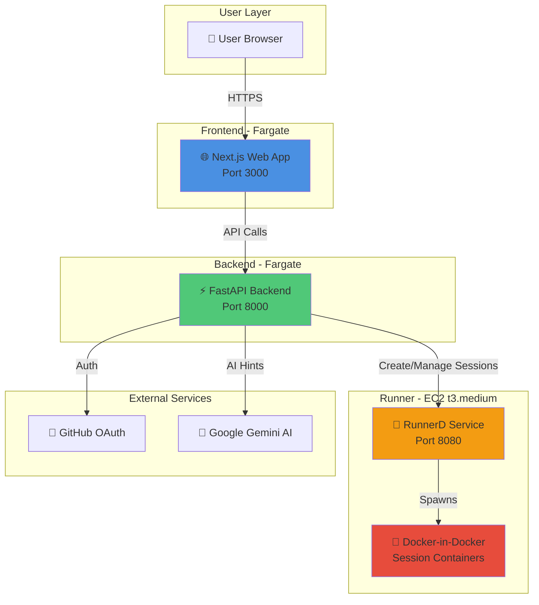
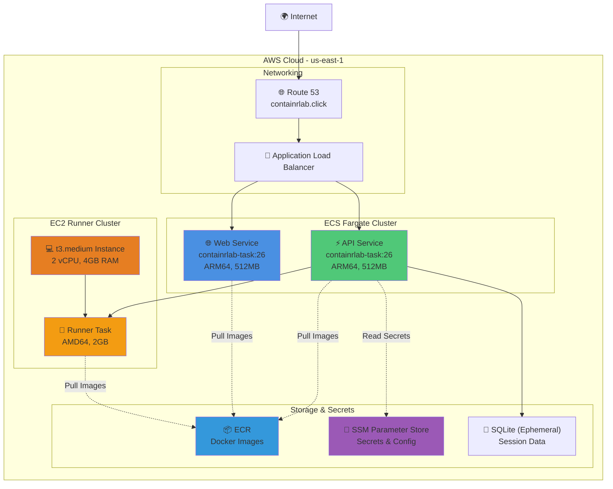
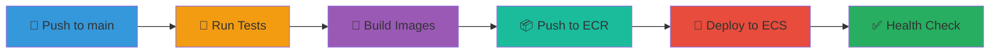

<div align="center">

# 🐳 ContainrLab

**Interactive Docker Learning Platform with AI-Powered Guidance**

[](https://app.containrlab.click)
[](LICENSE)
[](https://aws.amazon.com)
[](https://github.com/sanjayb-28/ContainrLab/actions)

[🚀 Live Demo](https://app.containrlab.click) • [📖 Documentation](docs/) • [🏗️ Architecture](#-architecture) • [🎓 Labs](#-labs)

</div>

---

## 📺 Demo

> **Video Walkthrough:** [Watch Demo](https://your-demo-video-link-here.com) *(placeholder - add your demo video)*


---

## 🌟 Features

<table>
<tr>
<td width="50%">

### 🎯 Core Features
- 🐳 **Interactive Docker Labs** - Hands-on container exercises
- 🤖 **AI Assistant** - Powered by Google Gemini for real-time hints
- 🖥️ **Live Terminal** - Full bash terminal in browser via WebSocket
- 📁 **File Manager** - Edit Dockerfiles and code directly
- ✅ **Automated Judging** - Instant feedback on your solutions
- 🔐 **GitHub OAuth** - Secure authentication

</td>
<td width="50%">

### ⚡ Technical Highlights
- 🏗️ **Multi-Architecture** - ARM64 & AMD64 support
- ☁️ **AWS ECS Fargate** - Serverless container deployment
- 🔄 **GitHub Actions CI/CD** - Automated testing & deployment
- 📦 **Docker-in-Docker** - Isolated lab environments
- 💾 **SQLite Storage** - Session & attempt tracking
- 🎨 **Next.js + React** - Modern responsive UI

</td>
</tr>
</table>

---

## 🏗️ Architecture

### High-Level Overview



### AWS Infrastructure



**🔗 Live URLs:**
- **Production App:** [https://app.containrlab.click](https://app.containrlab.click)
- **API Endpoint:** [https://api.containrlab.click](https://api.containrlab.click)
- **API Health:** [https://api.containrlab.click/healthz](https://api.containrlab.click/healthz)

**💰 Cost Optimization:**
- Monthly: ~$93/month (optimized for 1-2 concurrent users)
- EC2: t3.medium (burstable CPU credits)
- Session TTL: 30 minutes
- Container Memory: 1.5GB per session

See [docs/ARCHITECTURE.md](docs/ARCHITECTURE.md) for detailed architecture documentation.

---

## 🎓 Labs

Progressive Docker curriculum with automated validation:

| Lab | Topic | Difficulty | Key Concepts |
|-----|-------|------------|--------------|
| [Lab 1](labs/lab1/) | 🐳 First Dockerfile | ⭐ Beginner | Basic Docker, health checks, .dockerignore |
| [Lab 2](labs/lab2/) | ⚡ Layer Caching | ⭐⭐ Intermediate | Build optimization, layer ordering |
| [Lab 3](labs/lab3/) | 🏗️ Multi-stage Builds | ⭐⭐⭐ Advanced | Image size reduction, production builds |

Each lab includes:
- 📝 **Description** - Clear requirements and learning objectives
- ✅ **Automated Judge** - Instant validation and feedback
- 💡 **AI Hints** - Get unstuck with Gemini-powered guidance
- 📚 **Reference Solution** - Detailed walkthrough after completion

---

## 🚀 Quick Start

### Try it Live (Easiest)

1. Visit [https://app.containrlab.click](https://app.containrlab.click)
2. Sign in with GitHub
3. Click "Start Session" on any lab
4. Start learning Docker!

### Run Locally

<details>
<summary><b>📦 Prerequisites</b></summary>

- Docker Desktop (with Docker Compose)
- Node.js 20+
- Python 3.11+
- GitHub OAuth App ([setup guide](docs/CI-CD-SETUP.md))
- Google Gemini API Key (optional, for AI features)

</details>

<details>
<summary><b>🔧 Local Development Setup</b></summary>

```bash
# Clone repository
git clone https://github.com/sanjayb-28/ContainrLab.git
cd ContainrLab

# Set up secrets
echo "your-github-client-id" > compose/secrets/GITHUB_CLIENT_ID.txt
echo "your-github-client-secret" > compose/secrets/GITHUB_CLIENT_SECRET.txt
echo "your-gemini-api-key" > compose/secrets/GEMINI_API_KEY.txt  # Optional

# Start all services
docker compose -f compose/docker-compose.yml up

# Access the app
open http://localhost:3000
```

**Detailed guides:**
- [Local Development Runbook](docs/LOCAL_RUNBOOK.md)
- [GitHub OAuth Setup](docs/CI-CD-SETUP.md)
- [Gemini AI Configuration](backend/README.md#gemini-agent-integration)

</details>

<details>
<summary><b>☁️ Deploy to AWS</b></summary>

See [docs/DEPLOYMENTS.md](docs/DEPLOYMENTS.md) for complete AWS deployment guide.

**Quick overview:**
1. Build and push Docker images to ECR
2. Create ECS clusters (Fargate + EC2)
3. Set up secrets in SSM Parameter Store
4. Deploy services via GitHub Actions

</details>

---

## 📖 Documentation

### Getting Started
- [🚀 Quick Start Guide](docs/README.md)
- [💻 Local Development](docs/LOCAL_RUNBOOK.md)
- [🔐 GitHub OAuth Setup](docs/CI-CD-SETUP.md)

### Architecture & Design
- [🏗️ System Architecture](docs/ARCHITECTURE.md)
- [☁️ AWS Infrastructure](docs/DEPLOYMENTS.md)
- [🔄 CI/CD Pipeline](docs/CI-CD-SETUP.md)

### Component Documentation
- [⚡ Backend API](backend/README.md) - FastAPI service
- [🌐 Frontend](frontend/README.md) - Next.js web app
- [🔧 Runner](runner/README.md) - Docker-in-Docker service
- [⚖️ Judge](judge/README.md) - Lab validation logic

### Labs & Content
- [🎓 Lab Catalog](labs/README.md)
- [📝 Lab 1: First Dockerfile](labs/lab1/)
- [⚡ Lab 2: Layer Caching](labs/lab2/)
- [🏗️ Lab 3: Multi-stage Builds](labs/lab3/)

---

## 🛠️ Tech Stack

<table>
<tr>
<td valign="top" width="33%">

### Frontend
- ⚛️ Next.js 14
- 🎨 React 18
- 🎭 TailwindCSS
- 🔌 WebSocket (xterm.js)
- 🔐 NextAuth.js

</td>
<td valign="top" width="33%">

### Backend
- ⚡ FastAPI
- 🐍 Python 3.11
- 💾 SQLite
- 🤖 Google Gemini AI
- 🔌 WebSocket

</td>
<td valign="top" width="33%">

### Infrastructure
- ☁️ AWS ECS (Fargate + EC2)
- 🐳 Docker
- 🔄 GitHub Actions
- 📦 Amazon ECR
- 🔑 AWS SSM

</td>
</tr>
</table>

---

## 🔄 CI/CD Pipeline



**Automated workflows:**
- ✅ **Test on PR** - Backend & frontend tests
- 🔨 **Build** - Multi-architecture Docker images
- 📦 **Push** - Images to Amazon ECR
- 🚀 **Deploy** - Rolling updates to ECS
- 🔍 **Verify** - Health checks and smoke tests

See [.github/workflows/](. github/workflows/) for workflow definitions.

---

## 🤝 Contributing

Contributions are welcome! Please check out our [Contributing Guidelines](CONTRIBUTING.md) *(coming soon)*.

### Development Workflow

1. Fork the repository
2. Create a feature branch (`git checkout -b feature/amazing-feature`)
3. Make your changes
4. Run tests locally
5. Commit your changes (`git commit -m 'Add amazing feature'`)
6. Push to your branch (`git push origin feature/amazing-feature`)
7. Open a Pull Request

---

## 📝 License

This project is licensed under the MIT License - see the [LICENSE](LICENSE) file for details.

---

## 🙏 Acknowledgments

- **Google Gemini** - AI-powered hints and explanations
- **GitHub** - OAuth authentication and CI/CD
- **AWS** - Cloud infrastructure
- **Docker** - Containerization platform
- **FastAPI** - Modern Python web framework
- **Next.js** - React framework for production

---

## 📞 Support

- **Issues:** [GitHub Issues](https://github.com/sanjayb-28/ContainrLab/issues)
- **Discussions:** [GitHub Discussions](https://github.com/sanjayb-28/ContainrLab/discussions)
- **Email:** support@containrlab.click *(configure if needed)*

---

<div align="center">

**Made with ❤️ by [Sanjay Baskaran](https://github.com/sanjayb-28)**

⭐ Star this repo if you find it helpful!

</div>
