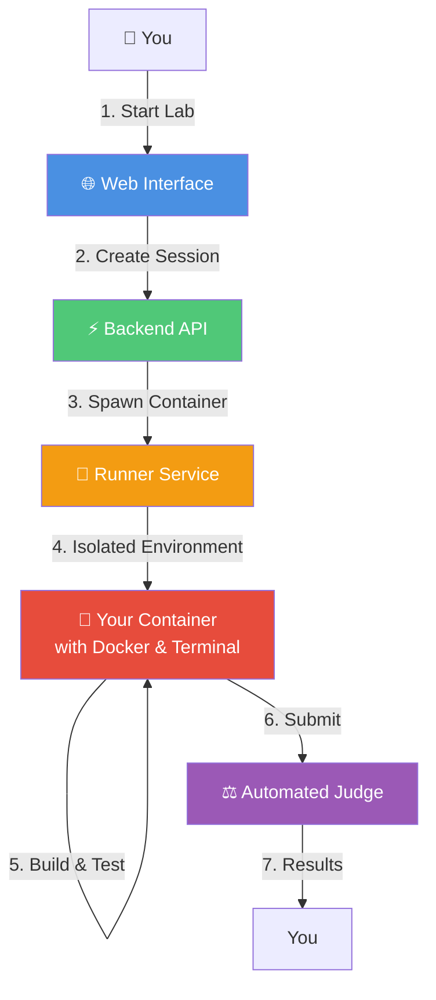

<div align="center">

# 🐳 ContainrLab

**Learn Docker through interactive, hands-on labs with AI-powered guidance**

[](https://app.containrlab.click)
[](LICENSE)
[](https://github.com/sanjayb-28/ContainrLab/actions)

[🚀 Try Live Demo](https://app.containrlab.click) • [📖 Documentation](docs/) • [🎓 Browse Labs](labs/) • [🏗️ Architecture](docs/ARCHITECTURE.md)

---

### 📺 Demo Video

[](https://www.loom.com/share/2620a2eaf62f4459862d5c9aaece4cd0)

</div>

---

## What is ContainrLab?

ContainrLab is an **interactive Docker learning platform** where you write real Dockerfiles, build images, and run containers in isolated environments. Get instant feedback from automated judges and AI-powered hints when you're stuck. No local setup required—everything runs in your browser.

---

## ✨ Key Features

- **🐳 Hands-On Labs** - Write real Docker code, not multiple-choice quizzes → [View Labs](labs/)
- **⚡ Instant Validation** - Automated judges test your solutions in real-time → [How it works](docs/ARCHITECTURE.md#judge-system)
- **🤖 AI Assistant** - Get contextual hints from Google Gemini when stuck → [Learn more](docs/ARCHITECTURE.md#ai-integration)
- **🖥️ Browser Terminal** - Full bash terminal with Docker-in-Docker → [Architecture](docs/ARCHITECTURE.md#runner-service)
- **📁 Code Editor** - Edit Dockerfiles and application code in real-time → [See UI](https://app.containrlab.click)
- **🔐 Secure & Isolated** - Each session runs in its own container with resource limits → [Security model](docs/ARCHITECTURE.md#security-model)

---

## 🏗️ How It Works



**[→ View detailed system architecture](docs/diagrams/system-architecture.md)**

---

## 🚀 Quick Start

### Option 1: Try Live (Fastest)

No installation needed. Sign in with GitHub and start learning immediately.

```
1. Visit https://app.containrlab.click
2. Sign in with GitHub OAuth
3. Choose a lab (start with Lab 1)
4. Click "Start Session" → you get a live terminal!
```

**[→ Start Learning Now](https://app.containrlab.click)**

---

### Option 2: Run Locally (Development)

Run the full stack on your machine with Docker Compose.

<details>
<summary><b>📦 Click to expand local setup</b></summary>

**Prerequisites:**
- Docker Desktop
- Node.js 20+
- Python 3.11+
- GitHub OAuth app ([setup guide](docs/CI-CD-SETUP.md#github-oauth))

**Quick Start:**
```bash
# Clone repository
git clone https://github.com/sanjayb-28/ContainrLab.git
cd ContainrLab

# Set up secrets
echo "your-github-client-id" > compose/secrets/GITHUB_CLIENT_ID.txt
echo "your-github-client-secret" > compose/secrets/GITHUB_CLIENT_SECRET.txt
echo "your-gemini-api-key" > compose/secrets/GEMINI_API_KEY.txt  # Optional

# Start services
docker compose -f compose/docker-compose.yml up

# Access at http://localhost:3000
```

**[→ Full local setup guide](docs/LOCAL_SETUP.md)**

</details>

---

### Option 3: Deploy to AWS (Production)

Deploy your own instance to AWS ECS with automated CI/CD.

<details>
<summary><b>☁️ Click to expand AWS deployment</b></summary>

**What you'll deploy:**
- ECS Fargate for API & Web (ARM64)
- EC2 for Runner (Docker-in-Docker)
- Application Load Balancer with HTTPS
- Automated GitHub Actions deployment

**Cost:** ~$93/month (optimized for 1-2 concurrent users)

**Time:** 2-3 hours for initial setup

**[→ Complete deployment guide](docs/DEPLOYMENTS.md)**

**[→ View AWS infrastructure diagram](docs/diagrams/aws-infrastructure.md)**

</details>

---

## 📚 Documentation

| Category | Documentation |
|----------|---------------|
| **🚀 Getting Started** | [Quick Start](#-quick-start) \| [Local Setup](docs/LOCAL_SETUP.md) \| [FAQs](docs/) |
| **🏗️ Architecture** | [System Design](docs/ARCHITECTURE.md) \| [AWS Infrastructure](docs/diagrams/aws-infrastructure.md) \| [Diagrams](docs/diagrams/) |
| **☁️ Deployment** | [AWS Deployment](docs/DEPLOYMENTS.md) \| [CI/CD Setup](docs/CI-CD-SETUP.md) \| [Secrets Management](docs/SECRETS_MANAGEMENT.md) |
| **🔧 Development** | [Backend](backend/) \| [Frontend](frontend/) \| [Runner](runner/) \| [Judge](judge/) |
| **🎓 Labs** | [Lab Catalog](labs/) \| [Lab 1](labs/lab1/) \| [Lab 2](labs/lab2/) \| [Lab 3](labs/lab3/) |

**[→ Browse all documentation](docs/)**

---

## 🎓 Labs

Progressive curriculum from beginner to advanced:

| Lab | Title | Difficulty | What You'll Learn |
|-----|-------|------------|-------------------|
| [Lab 1](labs/lab1/) | 🐳 First Dockerfile | ⭐ Beginner | Create a simple web service container from scratch |
| [Lab 2](labs/lab2/) | ⚡ Layer Caching | ⭐⭐ Intermediate | Optimize builds with proper layer ordering |
| [Lab 3](labs/lab3/) | 🏗️ Multi-stage Builds | ⭐⭐⭐ Advanced | Reduce image size with multi-stage Dockerfiles |

**Each lab includes:**
- Clear requirements and learning objectives
- Starter workspace (or empty canvas)
- Automated validation with detailed feedback
- AI-powered hints when you're stuck
- Reference solution with explanations

**[→ View complete lab catalog](labs/)**

---

## 🛠️ Tech Stack

<table>
<tr>
<td valign="top" width="33%">

### Frontend
- ⚛️ **Next.js 14** - React framework
- 🎨 **TailwindCSS** - Styling
- 🖥️ **xterm.js** - Terminal emulator
- 🔐 **NextAuth** - Authentication

</td>
<td valign="top" width="33%">

### Backend
- ⚡ **FastAPI** - Python API framework
- 🐍 **Python 3.11** - Backend logic
- 💾 **SQLite** - Session storage
- 🤖 **Gemini AI** - Intelligent hints
- 🔌 **WebSockets** - Real-time terminal

</td>
<td valign="top" width="33%">

### Infrastructure
- ☁️ **AWS ECS** - Container orchestration
- 🐳 **Docker** - Containerization
- 🔄 **GitHub Actions** - CI/CD automation
- 📦 **Amazon ECR** - Image registry
- 🔑 **AWS SSM** - Secrets management

</td>
</tr>
</table>

**[→ View detailed architecture](docs/ARCHITECTURE.md)**

---

## 🌟 Why ContainrLab?

| Traditional Learning | ContainrLab |
|---------------------|-------------|
| Read tutorials, copy-paste commands | Write real code in a real environment |
| No feedback on mistakes | Instant validation with specific error messages |
| Stuck? Google for hours | AI assistant provides contextual hints |
| Install Docker locally (or don't bother) | Everything in your browser, nothing to install |
| Isolated learning | Share progress, get help from community |

---

## 🤝 Contributing

We welcome contributions! Areas where we'd love help:

- 📚 **New Labs** - Create Docker learning content
- 🐛 **Bug Fixes** - Fix issues, improve stability  
- ✨ **Features** - Add new capabilities
- 📖 **Documentation** - Improve guides and examples
- 🧪 **Testing** - Increase test coverage

**[→ Read the full Contributing Guide](CONTRIBUTING.md)**

---

## 📊 Project Status

- ✅ **Production:** Fully deployed at [app.containrlab.click](https://app.containrlab.click)
- ✅ **CI/CD:** Automated testing and deployment via GitHub Actions
- ✅ **Labs:** 3 Docker labs (beginner to advanced)
- 🚧 **Roadmap:** More labs, Kubernetes content, team features

---

## 📄 License

This project is licensed under the **MIT License** - see [LICENSE](LICENSE) for details.

---

## 🙏 Acknowledgments

Built with:
- [Google Gemini](https://ai.google.dev/) - AI-powered learning assistance
- [Docker](https://www.docker.com/) - Containerization platform
- [AWS](https://aws.amazon.com/) - Cloud infrastructure
- [FastAPI](https://fastapi.tiangolo.com/) - Modern Python API framework
- [Next.js](https://nextjs.org/) - React framework for production

---

## 📞 Support & Community

- 🐛 **Issues:** [GitHub Issues](https://github.com/sanjayb-28/ContainrLab/issues)
- 💬 **Discussions:** [GitHub Discussions](https://github.com/sanjayb-28/ContainrLab/discussions)
- 📧 **Email:** sanjay.baskaran@colorado.edu

---

<div align="center">

**Made with ❤️ by [Sanjay Baskaran](https://github.com/sanjayb-28)**

⭐ **Star this repo if you find it helpful!**

[🚀 Start Learning Docker](https://app.containrlab.click) • [📖 Read the Docs](docs/) • [🎓 Browse Labs](labs/)

</div>
