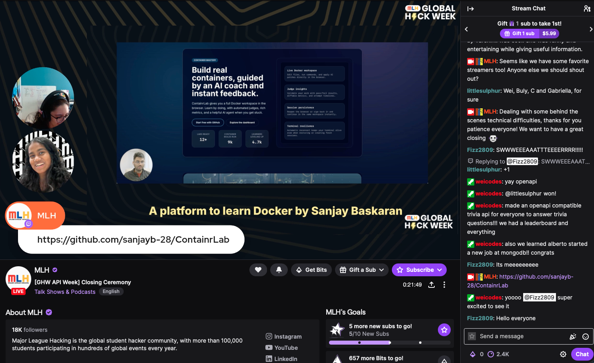
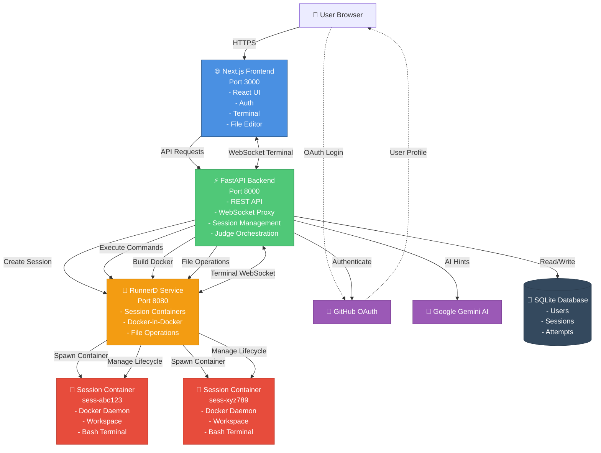

<div align="center">

# ContainrLab

**Cloud-native containerization training environment with real-time validation and LLM-assisted development**

[](https://app.containrlab.click)
[](LICENSE)
[](https://github.com/sanjayb-28/ContainrLab/actions)

[🚀 Try Live Demo](https://app.containrlab.click) • [📖 Documentation](docs/) • [🎓 Browse Labs](labs/) • [🏗️ Architecture](docs/ARCHITECTURE.md)

---

### 📺 Demo Video

[](https://www.loom.com/share/2620a2eaf62f4459862d5c9aaece4cd0)

</div>

---

## What is ContainrLab?

ContainrLab is a production-grade containerization training platform leveraging Docker-in-Docker isolation, WebSocket-based terminal emulation, and Google Gemini AI integration. Deploy multi-stage Dockerfiles, orchestrate container lifecycles, and execute commands in ephemeral sandbox environments—all delivered through a browser-based interface with zero client-side dependencies. The platform implements automated test harnesses for instant feedback, AI-driven contextual assistance, and supports full container runtime operations without local infrastructure requirements.

<div align="center">

<br>
<em>Showcased at MLH Global Hack Week</em>
</div>

---

## Key Features

- **Hands-On Labs** - Write real Docker code with practical, project-based exercises → [View Labs](labs/)
- **Instant Validation** - Automated judges test your solutions in real-time → [How it works](docs/ARCHITECTURE.md#judge-automated-validation)
- **AI Assistant** - Contextual hints powered by Google Gemini → [Learn more](docs/ARCHITECTURE.md)
- **Browser Terminal** - Full bash terminal with Docker-in-Docker capabilities → [Architecture](docs/ARCHITECTURE.md#runnerd-container-orchestrator)
- **Integrated Editor** - Edit Dockerfiles and application code directly in the browser → [See UI](https://app.containrlab.click)
- **Secure Isolation** - Individual containers with resource limits for each session → [Security model](docs/ARCHITECTURE.md#security-architecture)

---

## How It Works

### Session Lifecycle

1. **Start Lab** → User selects lab, API creates session record in database
2. **Spawn Environment** → RunnerD orchestrates isolated Docker container with Docker-in-Docker
3. **Interactive Terminal** → WebSocket establishes real-time bidirectional connection
4. **Code & Build** → User writes Dockerfiles, builds images, runs containers in sandbox
5. **Automated Validation** → Judge executes test harness against solution requirements
6. **Session Cleanup** → Environment auto-expires after timeout, resources freed

### Security Model

- **Isolation:** Each session runs in isolated Docker container with separate network namespace
- **Resource Limits:** CPU and memory constraints enforced per session container
- **Network Isolation:** Sessions cannot communicate with each other
- **Authentication:** GitHub OAuth with NextAuth.js session management
- **Secrets:** Environment variables injected at runtime from secure parameter store

---

## Architecture Overview


```mermaid
graph TB
    User[👤 User Browser]
    
    Web[🌐 Next.js Frontend<br/>Port 3000<br/>- React UI<br/>- Auth<br/>- Terminal<br/>- File Editor]
    
    API[⚡ FastAPI Backend<br/>Port 8000<br/>- REST API<br/>- WebSocket Proxy<br/>- Session Management<br/>- Judge Orchestration]
    
    RunnerD[🔧 RunnerD Service<br/>Port 8080<br/>- Session Containers<br/>- Docker-in-Docker<br/>- File Operations]
    
    Session1[🐋 Session Container<br/>sess-abc123<br/>- Docker Daemon<br/>- Workspace<br/>- Bash Terminal]
    Session2[🐋 Session Container<br/>sess-xyz789<br/>- Docker Daemon<br/>- Workspace<br/>- Bash Terminal]
    
    GitHub[🔐 GitHub OAuth]
    Gemini[🤖 Google Gemini AI]
    DB[(💾 SQLite Database<br/>- Users<br/>- Sessions<br/>- Attempts)]
    
    User -->|HTTPS| Web
    User -.->|OAuth Login| GitHub
    GitHub -.->|User Profile| User
    
    Web -->|API Requests| API
    Web <-->|WebSocket Terminal| API
    
    API -->|Authenticate| GitHub
    API -->|AI Hints| Gemini
    API -->|Read/Write| DB
    
    API -->|Create Session| RunnerD
    API -->|Execute Commands| RunnerD
    API -->|Build Docker| RunnerD
    API -->|File Operations| RunnerD
    API <-->|Terminal WebSocket| RunnerD
    
    RunnerD -->|Spawn Container| Session1
    RunnerD -->|Spawn Container| Session2
    RunnerD -->|Manage Lifecycle| Session1
    RunnerD -->|Manage Lifecycle| Session2
    
    classDef frontend fill:#4a90e2,stroke:#2d5a8c,color:#fff
    classDef backend fill:#50c878,stroke:#2d7a4a,color:#fff
    classDef runner fill:#f39c12,stroke:#c87f0a,color:#fff
    classDef session fill:#e74c3c,stroke:#c0392b,color:#fff
    classDef external fill:#9b59b6,stroke:#6c3483,color:#fff
    classDef storage fill:#34495e,stroke:#2c3e50,color:#fff
    
    class Web frontend
    class API backend
    class RunnerD runner
    class Session1,Session2 session
    class GitHub,Gemini external
    class DB storage
```

**[View detailed architecture documentation →](docs/ARCHITECTURE.md)**

---

## Production Infrastructure

### Cloud Architecture

- **ECS Fargate** for stateless services (API, Web)
- **ECS on EC2** for privileged workloads (Runner with Docker-in-Docker)
- **Application Load Balancer** for HTTPS traffic routing and SSL termination
- **Container Registry** for Docker image storage and distribution
- **Managed Secrets Storage** for secure environment variable injection

### Resource Allocation

- **API/Web:** Serverless compute with auto-scaling based on demand
- **Runner:** Dedicated compute instances with container orchestration
- **Session Isolation:** 1.5GB RAM, 1 vCPU per sandbox environment
- **Session Timeout:** 45-minute auto-expiration with grace period

### Deployment Architecture

- **Region:** Multi-AZ deployment in US East for high availability
- **Images:** AMD64 (x86_64) architecture for cross-platform compatibility
- **CI/CD:** Automated build, test, and deployment via GitHub Actions
- **Infrastructure:** Optimized for low-volume production workloads

---

## Getting Started

### Option 1: Live Demo

No installation required. Access the platform immediately with GitHub authentication.

```
1. Visit https://app.containrlab.click
2. Sign in with GitHub OAuth
3. Select a lab (Lab 1 recommended for beginners)
4. Click "Start Session" to launch your isolated environment
```

**[Start Learning →](https://app.containrlab.click)**

---

### Option 2: Local Development

Run the full stack on your machine with Docker Compose.

<details>
<summary><b>📦 Click to expand local setup</b></summary>

**Prerequisites:**
- Docker Desktop
- Node.js 20+
- Python 3.12+
- GitHub OAuth app ([setup guide](docs/LOCAL_SETUP.md#step-2-create-github-oauth-app))

**Quick Start:**
```bash
# Clone repository
git clone https://github.com/sanjayb-28/ContainrLab.git
cd ContainrLab

# Set up secrets
echo "your-github-client-id" > compose/secrets/GITHUB_CLIENT_ID.txt
echo "your-github-client-secret" > compose/secrets/GITHUB_CLIENT_SECRET.txt
echo "your-gemini-api-key" > compose/secrets/GEMINI_API_KEY.txt  # Optional

# Start services
docker compose -f compose/docker-compose.yml up

# Access at http://localhost:3000
```

**[View complete setup guide →](docs/LOCAL_SETUP.md)**

</details>

---

### Option 3: AWS Deployment

Deploy a production instance to AWS ECS with automated CI/CD pipelines.

<details>
<summary><b>☁️ Click to expand AWS deployment</b></summary>

**What you'll deploy:**
- ECS Fargate for API & Web (AMD64)
- EC2 for Runner (Docker-in-Docker)
- Application Load Balancer with HTTPS
- Automated GitHub Actions deployment

**Time:** 2-3 hours for initial setup

| **Region** | US East (Multi-AZ) |
| **Compute** | ECS Fargate (API/Web) + ECS on EC2 (Runner) |
| **Architecture** | AMD64 (x86_64) for all services |
| **Session TTL** | 45 minutes |

**[View deployment guide →](docs/DEPLOYMENT.md)**

</details>

---

## Documentation

| Category | Documentation |
|----------|---------------|
| **Getting Started** | [Quick Start](#getting-started) \| [Local Setup](docs/LOCAL_SETUP.md) |
| **Architecture** | [System Design](docs/ARCHITECTURE.md) |
| **Deployment** | [AWS Deployment](docs/DEPLOYMENT.md) |
| **Development** | [Backend](backend/README.md) \| [Frontend](frontend/README.md) \| [Runner](runner/README.md) \| [Judge](judge/README.md) |
| **Labs** | [Lab Catalog](labs/) \| [Lab 1](labs/lab1/) \| [Lab 2](labs/lab2/) \| [Lab 3](labs/lab3/) |

**[Browse all documentation →](docs/)**

---

## Lab Curriculum

Progressive learning path from beginner to advanced concepts:

| Lab | Title | Difficulty | What You'll Learn |
|-----|-------|------------|-------------------|
| [Lab 1](labs/lab1/) | First Dockerfile | Beginner | Create a simple web service container from scratch |
| [Lab 2](labs/lab2/) | Layer Caching | Intermediate | Optimize builds with proper layer ordering |
| [Lab 3](labs/lab3/) | Multi-stage Builds | Advanced | Reduce image size with multi-stage Dockerfiles |

**Each lab includes:**
- Clear requirements and learning objectives
- Starter workspace (or empty canvas)
- Automated validation with detailed feedback
- AI-powered hints when you're stuck
- Reference solution with explanations

**[View complete lab catalog →](labs/)**

---

## Technology Stack

<table>
<tr>
<td valign="top" width="33%">

### Frontend
- **Next.js 14** - React framework
- **TailwindCSS** - Styling system
- **xterm.js** - Terminal emulator
- **NextAuth** - Authentication

</td>
<td valign="top" width="33%">

### Backend
- **FastAPI** - Python API framework
- **Python 3.12** - Backend runtime
- **SQLite** - Session storage
- **Gemini AI** - Intelligent hints
- **WebSockets** - Real-time terminal communication

</td>
<td valign="top" width="33%">

### Infrastructure
- **AWS ECS** - Container orchestration
- **Docker** - Containerization platform
- **GitHub Actions** - CI/CD automation
- **Amazon ECR** - Container image registry
- **AWS SSM** - Secrets management

</td>
</tr>
</table>

### System Components

| Component | Technology | Purpose | Architecture |
|-----------|------------|---------|---------------|
| **Web UI** | Next.js 14, TailwindCSS, xterm.js | Frontend interface + terminal emulation | Server-side rendering, WebSocket client |
| **API** | FastAPI, Python 3.12, SQLite | REST API, session management | Async endpoints, connection pooling |
| **RunnerD** | Python, Docker SDK | Container orchestration supervisor | Event loop, Docker daemon communication |
| **Runner** | Docker-in-Docker, Bash | Isolated sandbox environments | Privileged containers, nested Docker |
| **Judge** | Python | Automated solution validation | Pluggable test harnesses |

**[View detailed architecture →](docs/ARCHITECTURE.md)**

---

## Why ContainrLab?

| Traditional Learning | ContainrLab |
|---------------------|-------------|
| Read tutorials, copy-paste commands | Write real code in a real environment |
| No feedback on mistakes | Instant validation with specific error messages |
| Stuck? Google for hours | AI assistant provides contextual hints |
| Install Docker locally (or don't bother) | Everything in your browser, nothing to install |
| Isolated learning | Share progress, get help from community |

---

## Contributing

Contributions are welcome! Key areas for contribution:

- **New Labs** - Create additional Docker learning content
- **Bug Fixes** - Resolve issues and improve stability
- **Features** - Develop new platform capabilities
- **Documentation** - Enhance guides and examples
- **Testing** - Expand test coverage

**[Read the Contributing Guide →](CONTRIBUTING.md)**

---

## Project Status

- ✅ **Production:** Fully deployed at [app.containrlab.click](https://app.containrlab.click)
- ✅ **CI/CD:** Automated testing and deployment via GitHub Actions
- ✅ **Labs:** 3 Docker labs (beginner to advanced)
- 🚧 **Roadmap:** More labs, Kubernetes content, team features

---

## License

This project is licensed under the **MIT License** - see [LICENSE](LICENSE) for details.

---

## Support

- **Issues:** [GitHub Issues](https://github.com/sanjayb-28/ContainrLab/issues)
- **Discussions:** [GitHub Discussions](https://github.com/sanjayb-28/ContainrLab/discussions)
- **Email:** sanjay.baskaran@colorado.edu

---

<div align="center">

**Developed by [Sanjay Baskaran](https://github.com/sanjayb-28)**

⭐ Star this repository if you find it helpful

[Start Learning →](https://app.containrlab.click) • [Documentation](docs/) • [Browse Labs](labs/)

</div>
