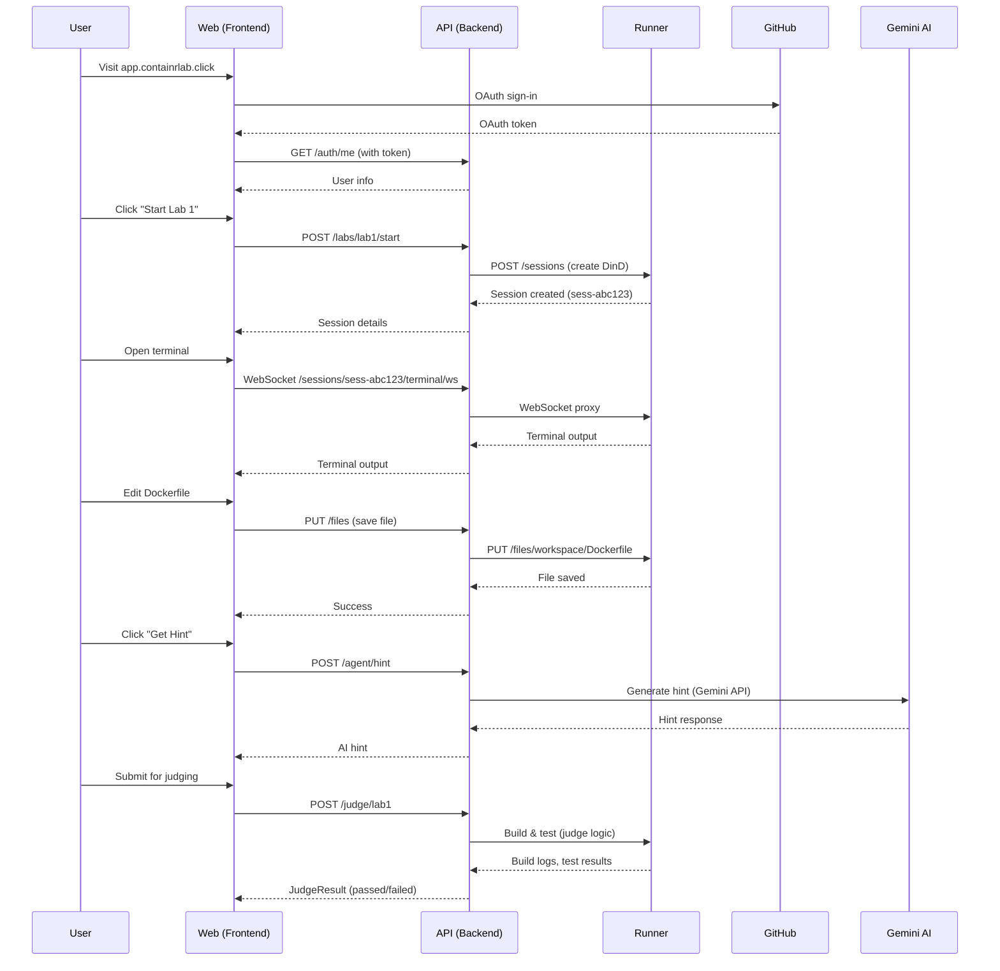

# 🏗️ ContainrLab Architecture

Comprehensive system architecture documentation for ContainrLab.

---

## Table of Contents

- [System Overview](#system-overview)
- [Component Architecture](#component-architecture)
- [Data Flow](#data-flow)
- [Infrastructure](#infrastructure)
- [Security Model](#security-model)
- [Scalability & Performance](#scalability--performance)

---

## System Overview

ContainrLab is a cloud-native, microservices-based platform for interactive Docker education. The system is designed with the following principles:

- **Isolation**: Each user session runs in an isolated Docker-in-Docker container
- **Scalability**: Horizontally scalable architecture using AWS ECS
- **Security**: Multi-layer security with OAuth, secrets management, and container isolation
- **Cost-Efficiency**: Optimized for 1-2 concurrent users (~$93/month)

###  High-Level Architecture

```
┌─────────────────────────────────────────────────────────────────┐
│                        User Browser                             │
│  ┌──────────────┐  ┌──────────────┐  ┌──────────────┐         │
│  │   Terminal   │  │ File Editor  │  │  AI Assistant│         │
│  └──────────────┘  └──────────────┘  └──────────────┘         │
└───────────────────────────┬─────────────────────────────────────┘
                            │ HTTPS
                            ↓
┌─────────────────────────────────────────────────────────────────┐
│              AWS Application Load Balancer                      │
│         (app.containrlab.click / api.containrlab.click)        │
└──────────────────┬──────────────────────────────┬───────────────┘
                   │                              │
        ┌──────────↓──────────┐        ┌─────────↓────────────┐
        │  Frontend (Fargate)  │        │  Backend (Fargate)   │
        │  Next.js + React     │        │  FastAPI + Python    │
        │  Port: 3000          │        │  Port: 8000          │
        │  ARM64, 512MB        │        │  ARM64, 512MB        │
        └──────────────────────┘        └────────┬─────────────┘
                                                  │
                                        ┌─────────↓────────────┐
                                        │  Runner (EC2)        │
                                        │  RunnerD + DinD      │
                                        │  t3.medium, 4GB      │
                                        │  AMD64               │
                                        └──────────────────────┘
```

---

## Component Architecture

### 1. Frontend (Next.js Web App)

**Technology:** Next.js 14, React 18, TailwindCSS, xterm.js

**Responsibilities:**
- Serve the web UI
- Handle GitHub OAuth flow (NextAuth.js)
- Manage WebSocket connections for terminal
- Real-time file editing interface
- AI assistant chat interface

**Key Files:**
- `/app` - Next.js 14 app router pages
- `/components` - Reusable React components
- `/lib` - Utilities and API clients
- `/hooks` - Custom React hooks

**Environment Variables:**
```bash
NEXT_PUBLIC_API_BASE=https://api.containrlab.click
GITHUB_CLIENT_ID=xxx
GITHUB_CLIENT_SECRET=xxx
NEXTAUTH_SECRET=xxx
NEXTAUTH_URL=https://app.containrlab.click
```

---

### 2. Backend (FastAPI API)

**Technology:** FastAPI, Python 3.11, SQLite, HTTPX, WebSockets

**Responsibilities:**
- REST API for labs, sessions, and file operations
- WebSocket proxy to runner terminals
- User authentication and session management
- AI hint generation (Google Gemini integration)
- Lab judging orchestration
- SQLite persistence for sessions and attempts

**API Endpoints:**

| Endpoint | Method | Purpose |
|----------|--------|---------|
| `/healthz` | GET | Health check |
| `/auth/me` | GET | Get current user |
| `/labs` | GET | List available labs |
| `/labs/{slug}` | GET | Get lab details |
| `/labs/{slug}/start` | POST | Start lab session |
| `/labs/{slug}/active` | GET | Get active session |
| `/sessions/{id}` | GET | Get session details |
| `/sessions/{id}/terminal/ws` | WebSocket | Terminal connection |
| `/files` | GET/POST/PUT/DELETE | File operations |
| `/agent/hint` | POST | Get AI hint |
| `/agent/explain` | POST | Get AI explanation |
| `/judge/{slug}` | POST | Submit lab for judging |

**Key Services:**
- **AuthService** - GitHub OAuth token management
- **AgentService** - Gemini AI integration with rate limiting
- **JudgeService** - Dispatches to lab-specific judges
- **RunnerClient** - HTTP client for runner API
- **Storage** - SQLite persistence layer

**Environment Variables:**
```bash
GITHUB_CLIENT_ID=xxx
GITHUB_CLIENT_SECRET=xxx
GEMINI_API_KEY=xxx  # or GEMINI_API_KEY_FILE
RUNNERD_BASE_URL=http://localhost:8080  # or runner ECS service
SESSION_TTL_SECONDS=1800  # 30 minutes
```

---

### 3. Runner (Docker-in-Docker Service)

**Technology:** Docker-in-Docker, Python, FastAPI

**Responsibilities:**
- Spawn isolated Docker-in-Docker containers for each session
- Execute Docker commands (build, run, exec, stop)
- Provide terminal access via bash
- File system operations within session containers
- Cleanup expired sessions

**Architecture:**
```
┌─────────────────────────────────────────┐
│         RunnerD (Port 8080)             │
│  ┌────────────────────────────────────┐ │
│  │    Session Manager                 │ │
│  └────────────────────────────────────┘ │
│                   │                      │
│  ┌────────────────↓────────────────────┐│
│  │   Docker-in-Docker Sessions        ││
│  │  ┌───────────────────────────────┐ ││
│  │  │  Session Container (sess-123) │ ││
│  │  │  - Docker daemon              │ ││
│  │  │  - User workspace (/workspace)│ ││
│  │  │  - Bash terminal              │ ││
│  │  │  - 1.5GB RAM, 1 vCPU          │ ││
│  │  └───────────────────────────────┘ ││
│  └─────────────────────────────────────┘│
└─────────────────────────────────────────┘
```

**Session Lifecycle:**
1. Backend requests session creation via `POST /sessions`
2. RunnerD spawns DinD container with unique session ID
3. Container runs for 30 minutes (TTL)
4. User interacts via terminal WebSocket and file API
5. Session expires or user ends session manually
6. RunnerD cleans up container and resources

**Key Endpoints:**
- `POST /sessions` - Create new session
- `GET /sessions/{id}` - Get session info
- `DELETE /sessions/{id}` - End session
- `POST /sessions/{id}/build` - Build Docker image
- `POST /sessions/{id}/run` - Run Docker container
- `POST /sessions/{id}/exec` - Execute command
- `GET /sessions/{id}/terminal/ws` - WebSocket terminal

---

### 4. Judge (Lab Validation)

**Technology:** Python modules

**Responsibilities:**
- Validate lab submissions
- Check Dockerfile structure and correctness
- Test running containers
- Provide detailed feedback and hints

**Judge Flow:**
```
User submits lab
       ↓
Backend calls judge_service.evaluate()
       ↓
Judge-specific module (lab1.py, lab2.py, lab3.py)
       ↓
┌─────────────────────────────────────────┐
│ 1. Read files (Dockerfile, .dockerignore) │
│ 2. Validate structure                   │
│ 3. Build image via runner              │
│ 4. Run container                        │
│ 5. Health check                         │
│ 6. Size check (Lab 3)                   │
└─────────────────────────────────────────┘
       ↓
Return JudgeResult (passed, failures, metrics)
       ↓
Frontend shows results to user
```

**Lab-Specific Judges:**
- **Lab 1**: Checks .dockerignore, build success, health endpoint
- **Lab 2**: Validates layer order, pip flags, caching
- **Lab 3**: Validates multi-stage, image size (<250MB), health

---

## Data Flow

### User Session Flow



### File Operation Flow

```
User edits file in browser
       ↓
Frontend sends PUT /files
       ↓
Backend forwards to Runner
       ↓
Runner writes to /workspace in session container
       ↓
User can see file in terminal (ls /workspace)
```

### Terminal Flow

```
User types command in terminal
       ↓
Frontend sends over WebSocket
       ↓
Backend proxies to Runner WebSocket
       ↓
Runner executes in bash shell
       ↓
Output streams back through WebSocket
       ↓
Frontend displays in xterm.js
```

---

## Infrastructure

### AWS Architecture

**Region:** us-east-1

**Components:**

1. **ECS Fargate Cluster** (`containrlab-cluster`)
   - **API/Web Tasks** (ARM64)
     - Task Definition: `containrlab-task:26`
     - CPU: 256 (0.25 vCPU)
     - Memory: 512 MB
     - Desired Count: 1 each
     - Auto-scaling: Not configured (single user load)

2. **EC2 Cluster** (`containrlab-runner-ec2`)
   - **Instance Type:** t3.medium (2 vCPU, 4GB RAM)
   - **AMI:** ECS-optimized Amazon Linux 2
   - **IAM Role:** ecsInstanceRole (with ECR pull permissions)
   - **Runner Task** (AMD64)
     - Task Definition: `containrlab-runner:9`
     - CPU: 1024 (1 vCPU)
     - Memory: 2048 MB
     - Host Port Mapping: 8080:8080

3. **Amazon ECR** (Elastic Container Registry)
   - **Repositories:**
     - `containrlab-api` (ARM64)
     - `containrlab-web` (ARM64)
     - `containrlab-runner` (AMD64)
     - `containrlab-runnerd` (AMD64)
   
4. **AWS SSM Parameter Store**
   - `/containrlab/GITHUB_CLIENT_ID`
   - `/containrlab/GITHUB_CLIENT_SECRET`
   - `/containrlab/NEXTAUTH_SECRET`
   - `/containrlab/GEMINI_API_KEY`
   - `/containrlab/SESSION_TTL_SECONDS`

5. **Application Load Balancer**
   - **Target Groups:**
     - `containrlab-api-tg` → API tasks (port 8000)
     - `containrlab-web-tg` → Web tasks (port 3000)
     - `containrlab-runner-tg-instance` → Runner EC2 (port 8080)
   - **Listeners:**
     - HTTPS:443 → Route by host header
       - `api.containrlab.click` → API
       - `app.containrlab.click` → Web

6. **Route 53**
   - **Domain:** `containrlab.click`
   - **Records:**
     - `app.containrlab.click` → ALB
     - `api.containrlab.click` → ALB

### Network Architecture

```
Internet Gateway
       ↓
┌──────────────────────────────────────┐
│          VPC (Default)               │
│                                      │
│  ┌───────────────────────────────┐  │
│  │    Public Subnet (AZ-1)       │  │
│  │  - ALB                        │  │
│  │  - ECS Tasks (Fargate)        │  │
│  │  - EC2 Instance               │  │
│  └───────────────────────────────┘  │
│                                      │
│  Security Groups:                    │
│  - ALB: 80, 443 from 0.0.0.0/0      │
│  - ECS Tasks: 8000, 3000 from ALB   │
│  - EC2: 8080 from ALB, 22 from admin│
└──────────────────────────────────────┘
```

---

## Security Model

### Authentication & Authorization

**GitHub OAuth Flow:**
1. User clicks "Sign in with GitHub"
2. Redirected to GitHub OAuth
3. GitHub redirects back with code
4. Backend exchanges code for access token
5. Backend fetches user profile from GitHub API
6. Backend creates/updates user in SQLite
7. NextAuth.js creates session JWT
8. JWT stored in HTTP-only cookie
9. All API requests include JWT in cookie
10. Backend validates JWT on each request

**Token Storage:**
- Access tokens encrypted and stored in SQLite
- JWTs are HTTP-only, secure, SameSite cookies
- No tokens in localStorage or sessionStorage

### Secrets Management

**Development (Local):**
- Secrets in `compose/secrets/*.txt` (gitignored)
- Mounted as Docker secrets in containers

**Production (AWS):**
- Secrets in SSM Parameter Store (encrypted)
- Injected as environment variables at runtime
- IAM roles control access to parameters
- No secrets in Docker images or code

### Container Isolation

**User Sessions:**
- Each session runs in isolated Docker-in-Docker container
- No network access between sessions
- Resource limits (1.5GB RAM, 1 vCPU per session)
- 30-minute TTL, auto-cleanup
- User cannot escape container (no privileged mode)

**Dockerfile Validation:**
- Judge validates Dockerfile structure before build
- No arbitrary code execution
- Build happens in isolated environment
- Failed builds don't affect system

---

## Scalability & Performance

### Current Capacity

**Optimized for 1-2 concurrent users:**
- 1x t3.medium EC2: 2 sessions max (comfortably)
- 1x Fargate API task: Handles 10-20 req/sec
- 1x Fargate Web task: Serves 50+ users

**Bottlenecks:**
1. **Runner EC2 Memory** - 4GB limits to ~2 concurrent sessions
2. **SQLite Write Contention** - Single-writer limitation
3. **Gemini API Rate Limits** - 5 req/min per session (enforced in code)

### Scaling Strategies

**Horizontal Scaling (Future):**

1. **Add More EC2 Instances:**
   - Auto Scaling Group with t3.medium instances
   - Each instance handles 2 sessions
   - Runner service discovers instances via ECS
   - Cost: +$30/month per instance

2. **Replace SQLite with RDS:**
   - PostgreSQL on db.t3.micro
   - Supports concurrent writes
   - Persistent storage across deployments
   - Cost: +$15-20/month

3. **Add Redis Cache:**
   - Cache user profiles, lab metadata
   - Reduce database load
   - Session state management
   - Cost: +$10-15/month (ElastiCache)

4. **API Auto-Scaling:**
   - ECS Service Auto Scaling
   - Target: CPU 70%, Memory 80%
   - Scale 1-5 tasks
   - Cost: Marginal (+$5-10/month at scale)

### Performance Optimizations

**Current:**
- ✅ Docker layer caching (build-time)
- ✅ API response gzip compression
- ✅ Static asset CDN (Next.js automatic)
- ✅ WebSocket connection reuse
- ✅ Efficient SQLite queries with indexes

**Future:**
- ⏳ Redis caching layer
- ⏳ API rate limiting (per-user)
- ⏳ Lab content CDN
- ⏳ Background job queue for judging

---

## Monitoring & Observability

### Current Monitoring

**AWS CloudWatch:**
- ECS service metrics (CPU, memory, task count)
- ALB metrics (request count, latency, errors)
- EC2 instance metrics (CPU, memory, disk)

**Application Logs:**
- Container logs → CloudWatch Logs
- Log groups:
  - `/ecs/containrlab-api`
  - `/ecs/containrlab-web`
  - `/ecs/containrlab-runner`

**Health Checks:**
- ALB health checks every 30s
- API: `GET /healthz` → 200 OK
- Web: `GET /` → 200 OK
- Runner: `GET /health` → 200 OK

### Future Observability

**Recommended Additions:**
- **Metrics**: Prometheus + Grafana
- **Tracing**: OpenTelemetry or AWS X-Ray
- **Alerts**: CloudWatch Alarms for critical metrics
- **User Analytics**: PostHog or Mixpanel

---

## Cost Breakdown

**Monthly AWS Costs (~$93/month):**

| Service | Resource | Cost |
|---------|----------|------|
| **EC2** | t3.medium (24/7) | ~$30 |
| **ECS Fargate** | API + Web tasks (ARM64) | ~$15 |
| **ECS EC2** | Runner task (on EC2) | ~$0 (included) |
| **ALB** | Application Load Balancer | ~$20 |
| **ECR** | Image storage (~10GB) | ~$1 |
| **Data Transfer** | Outbound (< 10GB) | ~$1 |
| **SSM** | Parameter Store (free tier) | $0 |
| **Route 53** | Hosted zone + queries | ~$1 |
| **CloudWatch Logs** | Log storage/ingestion | ~$5 |
| **Other** | Misc (NAT, etc.) | ~$20 |

**Cost Optimization Applied:**
- EC2: m7i.large → t3.medium (26% reduction)
- Session TTL: 45min → 30min (faster cleanup)
- Container memory: 2GB → 1.5GB (more efficient)

---

## Disaster Recovery

**Current State:**
- **RTO (Recovery Time Objective):** ~15 minutes
- **RPO (Recovery Point Objective):** ~30 minutes (session data loss)

**Backup Strategy:**
- Docker images: Stored in ECR (persistent)
- Code: Git repository (GitHub)
- Secrets: SSM Parameter Store (encrypted, backed up by AWS)
- **Session data: EPHEMERAL** (lost on deployment)

**Recovery Procedure:**
1. Rollback to previous task definition
2. Or redeploy from GitHub Actions
3. ECS performs rolling update
4. No user intervention required

**Single Points of Failure:**
- ALB (AWS managed, multi-AZ)
- EC2 instance (manual intervention needed)
- Fargate tasks (ECS restarts automatically)

---

## Future Enhancements

### Short-term (1-3 months)
- [ ] Add persistent storage (EFS or RDS)
- [ ] Implement user progress tracking
- [ ] Add more labs (Lab 4-6)
- [ ] Improve AI hints with context awareness
- [ ] Add code snippets in hints

### Medium-term (3-6 months)
- [ ] Multi-language support (Go, Rust, Node.js labs)
- [ ] Team/classroom features
- [ ] Progress dashboards
- [ ] Leaderboards and achievements
- [ ] Video tutorials integration

### Long-term (6-12 months)
- [ ] Kubernetes labs
- [ ] Advanced networking labs
- [ ] Security and scanning labs
- [ ] Custom lab creation (user-submitted)
- [ ] White-label solution for enterprises

---

## References

- [AWS ECS Best Practices](https://docs.aws.amazon.com/AmazonECS/latest/bestpracticesguide/)
- [Docker-in-Docker Security](https://jpetazzo.github.io/2015/09/03/do-not-use-docker-in-docker-for-ci/)
- [FastAPI Production Guide](https://fastapi.tiangolo.com/deployment/)
- [Next.js Deployment](https://nextjs.org/docs/deployment)

---

<div align="center">

**[← Back to Main README](../README.md)** | **[View Deployment Guide →](DEPLOYMENTS.md)**

</div>
