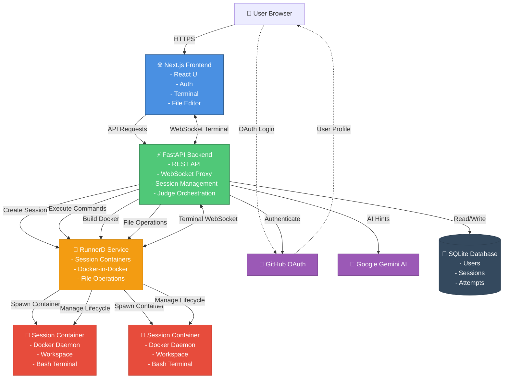
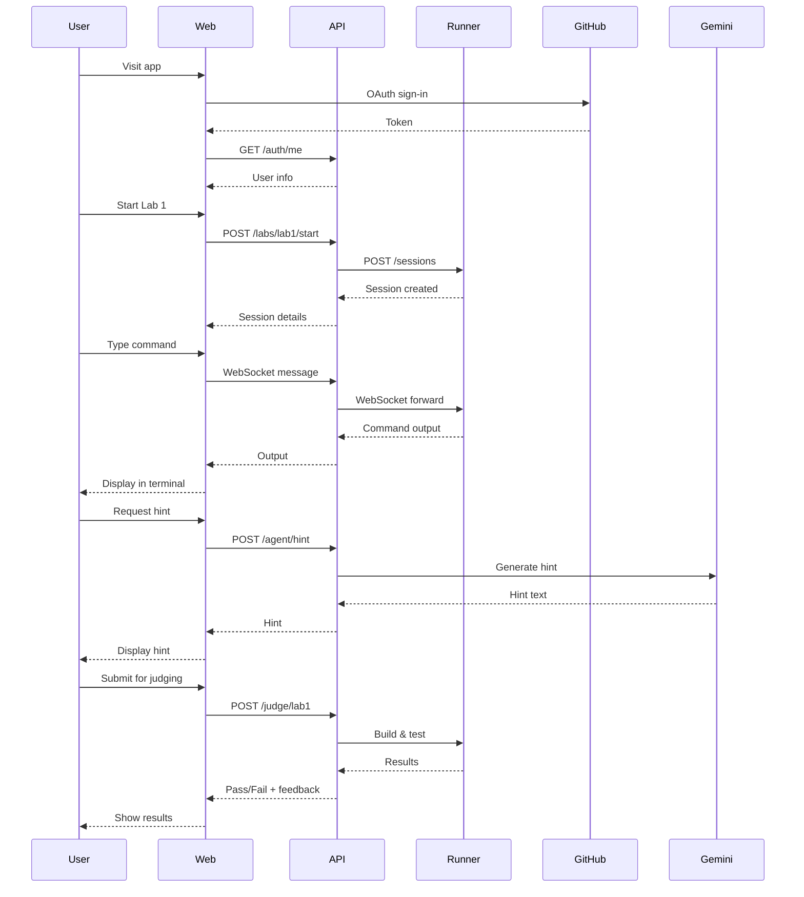

# 🏗️ ContainrLab System Architecture

Complete technical architecture of the ContainrLab platform.

---

## Overview

ContainrLab is a cloud-native microservices platform that provides **isolated Docker environments** in the browser. Users write Dockerfiles, build images, and run containers in **Docker-in-Docker sessions** with real-time feedback.

**Core Principle:** Every user gets an isolated container with full Docker access for 30 minutes.

---

## System Architecture



**[→ View full diagram with details](diagrams/system-architecture.md)**

---

## Components

### Frontend: Next.js Web Application

**Technology:** Next.js 14, React 18, TailwindCSS, xterm.js, NextAuth.js

**Responsibilities:**
- User interface with terminal emulator and code editor
- GitHub OAuth authentication flow
- Real-time WebSocket terminal connection
- File editing and management
- Lab progress tracking

**Key Features:**
- **Terminal:** xterm.js provides full-featured terminal in browser
- **Editor:** Monaco-style editor for Dockerfile and code editing
- **Auth:** NextAuth.js handles OAuth with GitHub
- **State:** React hooks manage session and file state

**Architecture:**
```
app/
├── (auth)/          # Authentication pages
├── labs/            # Lab listing and detail pages
├── session/         # Active session interface
└── api/             # NextAuth API routes

components/
├── Terminal/        # xterm.js terminal component
├── FileTree/        # File browser
├── Editor/          # Code editor
└── JudgeResults/    # Validation feedback
```

**[→ Frontend documentation](../frontend/README.md)**

---

### Backend: FastAPI Service

**Technology:** FastAPI, Python 3.11, SQLite, HTTPX, WebSockets

**Responsibilities:**
- REST API for all operations
- WebSocket proxy between frontend and runner
- Session lifecycle management
- User authentication and authorization
- Judge orchestration for lab validation
- Data persistence

**API Structure:**
```
/auth/*              # Authentication endpoints
/labs/*              # Lab information
/sessions/*          # Session management
/sessions/{id}/terminal/ws  # Terminal WebSocket
/files/*             # File operations
/agent/*             # AI hint generation
/judge/{lab}         # Lab validation
```

**Key Services:**
- **AuthService:** Validates GitHub tokens, manages user sessions
- **SessionManager:** Tracks active sessions, enforces TTL
- **RunnerClient:** HTTP client for runner API
- **AgentService:** Google Gemini AI integration with rate limiting
- **JudgeService:** Dispatches to lab-specific judges

**Data Models:**
- **User:** GitHub ID, login, avatar
- **Session:** ID, user_id, lab_slug, container, TTL, timestamps
- **Attempt:** Session, lab, passed, failures, metrics

**[→ Backend documentation](../backend/README.md)**

---

### Runner: Docker-in-Docker Service

**Technology:** Docker-in-Docker, Python, FastAPI

**Responsibilities:**
- Spawn isolated session containers
- Execute Docker commands in sessions
- Provide bash terminal access
- File system operations
- Session cleanup

**Architecture:**
```
RunnerD (Port 8080)
    ↓
Session Containers (Docker-in-Docker)
    ├── sess-abc123 (1.5GB RAM, 1 vCPU)
    │   ├── Docker daemon
    │   ├── /workspace (user files)
    │   └── bash terminal
    └── sess-xyz789
        └── ...
```

**API Endpoints:**
- `POST /sessions` - Create new DinD container
- `POST /sessions/{id}/build` - Build Docker image
- `POST /sessions/{id}/run` - Run Docker container
- `POST /sessions/{id}/exec` - Execute command
- `GET/POST/PUT/DELETE /files` - File operations
- `GET /sessions/{id}/terminal/ws` - Terminal WebSocket
- `DELETE /sessions/{id}` - Cleanup session

**Session Lifecycle:**
1. **Create:** Spawn DinD container with unique ID
2. **Initialize:** Docker daemon starts, workspace created
3. **Active:** User builds images, runs containers, edits files
4. **Expire:** 30 minutes TTL or manual end
5. **Cleanup:** Stop all containers, remove DinD container

**[→ Session lifecycle diagram](diagrams/session-lifecycle.md)**

**[→ Runner documentation](../runner/README.md)**

---

### Judge: Automated Validation

**Technology:** Python modules, Async/await

**Responsibilities:**
- Validate lab submissions
- Test Dockerfile structure
- Build and run containers
- Check functionality
- Provide detailed feedback

**Judge Flow:**
```
User submits lab
    ↓
Backend: judge_service.evaluate(lab_slug, session_id)
    ↓
Lab-specific judge (lab1.py, lab2.py, lab3.py)
    ↓
┌─────────────────────────────────────┐
│ 1. Read files (Dockerfile, etc.)   │
│ 2. Validate structure               │
│ 3. Build image via runner           │
│ 4. Run container                    │
│ 5. Test functionality               │
│ 6. Check metrics (size, etc.)       │
└─────────────────────────────────────┘
    ↓
Return JudgeResult(passed, failures, metrics)
    ↓
Frontend displays results to user
```

**Lab-Specific Judges:**
- **Lab 1:** Checks `.dockerignore`, build success, health endpoint
- **Lab 2:** Validates layer order, pip flags, caching
- **Lab 3:** Multi-stage structure, image size < 250MB, functionality

**JudgeResult Model:**
```python
{
  "passed": bool,
  "failures": [
    {"code": str, "message": str, "hint": str}
  ],
  "metrics": {
    "build": {"elapsed_seconds": float},
    "image_size_mb": float
  },
  "notes": {
    "build_logs": [str],
    "runtime_logs": [str]
  }
}
```

**[→ Judge documentation](../judge/README.md)**

---

## Data Flow

### User Session Flow



---

## Security Model

### Authentication

**GitHub OAuth Flow:**
1. User redirects to GitHub for authorization
2. GitHub redirects back with authorization code
3. Backend exchanges code for access token
4. Backend fetches user profile from GitHub API
5. Backend creates/updates user in database
6. NextAuth.js creates JWT session token
7. JWT stored in HTTP-only, secure cookie
8. All API requests validated via JWT

**Token Storage:**
- Frontend: HTTP-only cookies (not accessible to JavaScript)
- Backend: Encrypted in SQLite database
- Runner: No authentication (only accessible from backend)

---

### Container Isolation

**Session Security:**
- Each session runs in isolated Docker-in-Docker container
- No network access between sessions
- Resource limits enforced: 1.5GB RAM, 1 vCPU
- 30-minute TTL prevents resource exhaustion
- All containers removed on session end

**User Capabilities (What users CAN do):**
- ✅ Build Docker images
- ✅ Run containers on port 8080
- ✅ Execute bash commands
- ✅ Create/edit files in `/workspace`
- ✅ Install packages in containers

**User Restrictions (What users CANNOT do):**
- ❌ Access other users' sessions
- ❌ Bypass resource limits
- ❌ Access runner host system
- ❌ Make external network requests (isolated)
- ❌ Run sessions longer than 30 minutes

---

### Secrets Management

**Development (Local):**
- Secrets in `compose/secrets/` directory
- Mounted as Docker secrets
- Gitignored

**Production (AWS):**
- Stored in AWS SSM Parameter Store
- Encrypted at rest
- Injected as environment variables
- IAM roles control access

**[→ Complete secrets guide](SECRETS_MANAGEMENT.md)**

---

## Database

### Technology

**SQLite** - File-based relational database

**Why SQLite:**
- Simple deployment (no separate database server)
- Sufficient for current scale (1-2 concurrent users)
- Fast for read-heavy workloads
- Zero configuration

**Location:**
- Local: `sqlite/app.db`
- Production: `/sqlite/app.db` (ephemeral, in container)

**Ephemeral Nature:**
- Database resets on deployment
- User sessions lost on restart
- Judge attempts not persisted long-term
- Fine for current use case (learning platform)

---

### Schema

**Users:**
```sql
CREATE TABLE users (
    github_id INTEGER PRIMARY KEY,
    login TEXT NOT NULL,
    avatar_url TEXT,
    created_at TIMESTAMP DEFAULT CURRENT_TIMESTAMP
);
```

**Sessions:**
```sql
CREATE TABLE sessions (
    session_id TEXT PRIMARY KEY,
    user_id INTEGER NOT NULL,
    lab_slug TEXT NOT NULL,
    runner_container TEXT,
    ttl_seconds INTEGER DEFAULT 1800,
    created_at TIMESTAMP,
    expires_at TIMESTAMP,
    ended_at TIMESTAMP,
    FOREIGN KEY (user_id) REFERENCES users(github_id)
);
```

**Judge Attempts:**
```sql
CREATE TABLE judge_attempts (
    id INTEGER PRIMARY KEY AUTOINCREMENT,
    session_id TEXT NOT NULL,
    lab_slug TEXT NOT NULL,
    passed BOOLEAN NOT NULL,
    failures TEXT,  -- JSON
    metrics TEXT,   -- JSON
    submitted_at TIMESTAMP DEFAULT CURRENT_TIMESTAMP,
    FOREIGN KEY (session_id) REFERENCES sessions(session_id)
);
```

---

### Persistence Options (Future)

For production scale or persistence requirements:

**Option 1: AWS RDS (PostgreSQL)**
- Persistent across deployments
- Multi-user writes
- Cost: +$15-20/month

**Option 2: AWS EFS**
- Shared file system for SQLite
- Persistent but still single-writer
- Cost: ~$5/month

**Option 3: Keep SQLite**
- Current approach works for learning platform
- No historical data needed
- Users can re-do labs anytime

---

## AI Integration

### Google Gemini AI

**Purpose:** Provide contextual hints and explanations to learners

**Integration:**
```
User clicks "Get Hint"
    ↓
Frontend: POST /agent/hint
    ↓
Backend: AgentService.generate_hint()
    ↓
Google Gemini API (models/gemini-1.5-flash)
    ↓
Response: Contextual hint about current step
    ↓
Frontend displays hint to user
```

**Features:**
- Contextual hints based on lab and user progress
- Code explanations for Docker concepts
- Error message interpretation
- Rate limited: 5 requests per minute per session

**Fallback:**
- If API key missing: Deterministic stub responses
- If API fails: Graceful degradation
- Never blocks lab completion

**Configuration:**
```bash
GEMINI_API_KEY=xxx
GEMINI_MODEL=models/gemini-1.5-flash
GEMINI_TEMPERATURE=0.7
GEMINI_MAX_OUTPUT_TOKENS=512
GEMINI_TIMEOUT_SECONDS=20
```

---

## Performance & Scalability

### Current Capacity

**Designed for:** 1-2 concurrent users

**Resources:**
- EC2 Instance: t3.medium (2 vCPU, 4GB RAM)
- Max concurrent sessions: 2
- Session resources: 1.5GB RAM, 1 vCPU each
- Session TTL: 30 minutes

**Bottlenecks:**
1. **EC2 Memory:** 4GB limits concurrent sessions
2. **SQLite:** Single-writer limitation
3. **No horizontal scaling:** Single runner instance

---

### Scaling Strategies

**Horizontal Scaling (10-50 users):**
1. Add more EC2 instances for runner
2. Load balance across runner instances
3. Replace SQLite with PostgreSQL (RDS)
4. Add Redis for caching and session state
5. Auto-scale ECS tasks based on load

**Cost:** ~$200-300/month

**Vertical Scaling (2-5 users):**
1. Upgrade EC2 to m5.large (8GB RAM)
2. Increase session limits to 4-5 concurrent
3. Keep SQLite (still sufficient)

**Cost:** ~$130/month

**[→ AWS infrastructure details](AWS_INFRASTRUCTURE.md)**

---

## Technology Choices

### Why These Technologies?

| Technology | Reason |
|------------|--------|
| **Next.js** | Server-side rendering, great DX, built-in API routes |
| **FastAPI** | Modern Python framework, async support, automatic docs |
| **Docker-in-Docker** | True isolation, full Docker capabilities per user |
| **SQLite** | Simple, fast, sufficient for current scale |
| **ECS Fargate** | Serverless containers, easy scaling, no server management |
| **GitHub OAuth** | Users already have accounts, simple integration |
| **Gemini AI** | Free tier, good for learning assistance |

---

## Design Decisions

### Why Docker-in-Docker?

**Alternative considered:** Shared Docker daemon

**Why DinD is better:**
- ✅ True isolation between users
- ✅ Each user has full Docker capabilities
- ✅ No risk of user A seeing user B's containers
- ✅ Easy cleanup (remove whole container)
- ❌ More resource-intensive
- ❌ Requires privileged mode

**Decision:** DinD for security and isolation

---

### Why 30-Minute Sessions?

**Alternatives:**
- Longer (60+ min): Resource exhaustion, higher costs
- Shorter (15 min): Not enough time to complete labs
- Unlimited: Abuse risk, costs spiral

**Why 30 minutes:**
- ✅ Enough time for any lab
- ✅ Forces users to stay engaged
- ✅ Automatic cleanup prevents abuse
- ✅ Resource costs manageable

---

### Why Ephemeral Database?

**Alternative:** Persistent PostgreSQL RDS

**Why SQLite (ephemeral) works:**
- ✅ This is a learning platform, not a production app
- ✅ Users don't need progress history
- ✅ Labs can be re-done anytime
- ✅ Saves ~$20/month
- ✅ Simpler architecture

**When to change:** If we add progress tracking, leaderboards, or certificates

---

## Related Documentation

- **[Deployment Guide](DEPLOYMENTS.md)** - How to deploy this architecture to AWS
- **[AWS Infrastructure](AWS_INFRASTRUCTURE.md)** - Detailed AWS resource breakdown
- **[CI/CD Setup](CI-CD-SETUP.md)** - Automated deployment pipeline
- **[Diagrams](diagrams/)** - All architecture diagrams

---

<div align="center">

**[← Back to Documentation Hub](README.md)** | **[Deploy to AWS →](DEPLOYMENTS.md)**

</div>
