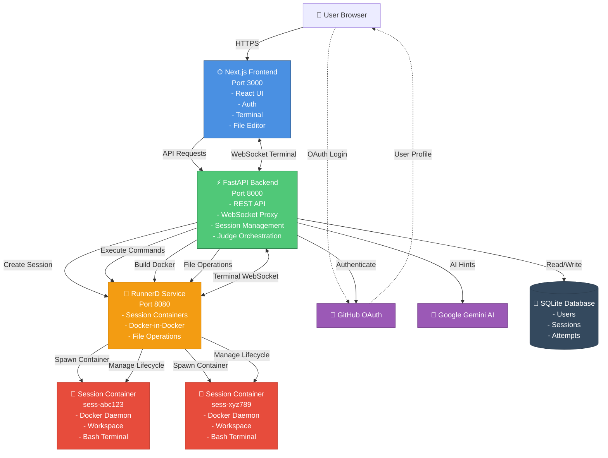
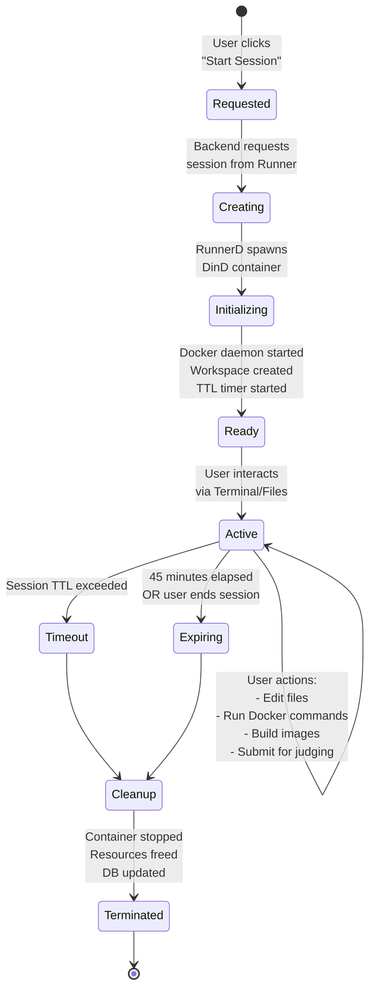
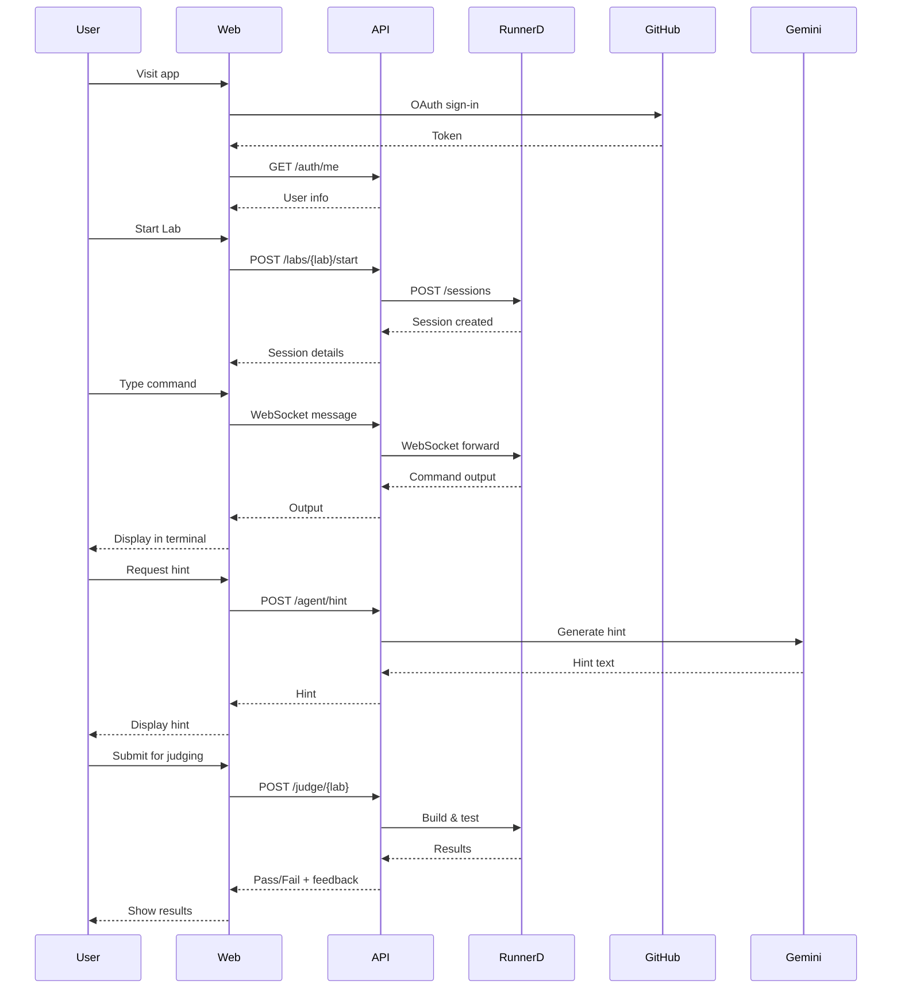
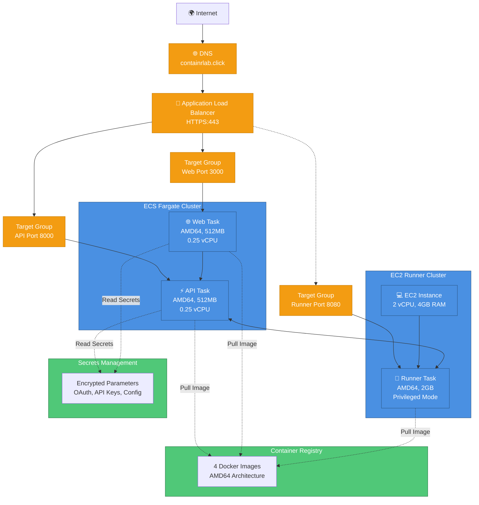
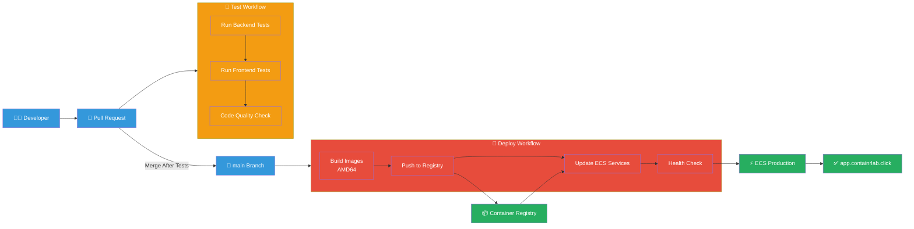

# System Architecture

Complete technical architecture of the ContainrLab platform.

---

## Overview

ContainrLab is a cloud-native microservices platform that provides **isolated Docker environments** in the browser. Users write Dockerfiles, build images, and run containers in **Docker-in-Docker sessions** with real-time feedback and automated validation.

**Core Principle:** Every user gets an isolated container with full Docker access for 45 minutes.

---

## System Architecture


```mermaid
graph TB
    User[👤 User Browser]
    
    Web[🌐 Next.js Frontend<br/>Port 3000<br/>- React UI<br/>- Auth<br/>- Terminal<br/>- File Editor]
    
    API[⚡ FastAPI Backend<br/>Port 8000<br/>- REST API<br/>- WebSocket Proxy<br/>- Session Management<br/>- Judge Orchestration]
    
    RunnerD[🔧 RunnerD Service<br/>Port 8080<br/>- Session Containers<br/>- Docker-in-Docker<br/>- File Operations]
    
    Session1[🐋 Session Container<br/>sess-abc123<br/>- Docker Daemon<br/>- Workspace<br/>- Bash Terminal]
    Session2[🐋 Session Container<br/>sess-xyz789<br/>- Docker Daemon<br/>- Workspace<br/>- Bash Terminal]
    
    GitHub[🔐 GitHub OAuth]
    Gemini[🤖 Google Gemini AI]
    DB[(💾 SQLite Database<br/>- Users<br/>- Sessions<br/>- Attempts)]
    
    User -->|HTTPS| Web
    User -.->|OAuth Login| GitHub
    GitHub -.->|User Profile| User
    
    Web -->|API Requests| API
    Web <-->|WebSocket Terminal| API
    
    API -->|Authenticate| GitHub
    API -->|AI Hints| Gemini
    API -->|Read/Write| DB
    
    API -->|Create Session| RunnerD
    API -->|Execute Commands| RunnerD
    API -->|Build Docker| RunnerD
    API -->|File Operations| RunnerD
    API <-->|Terminal WebSocket| RunnerD
    
    RunnerD -->|Spawn Container| Session1
    RunnerD -->|Spawn Container| Session2
    RunnerD -->|Manage Lifecycle| Session1
    RunnerD -->|Manage Lifecycle| Session2
    
    classDef frontend fill:#4a90e2,stroke:#2d5a8c,color:#fff
    classDef backend fill:#50c878,stroke:#2d7a4a,color:#fff
    classDef runner fill:#f39c12,stroke:#c87f0a,color:#fff
    classDef session fill:#e74c3c,stroke:#c0392b,color:#fff
    classDef external fill:#9b59b6,stroke:#6c3483,color:#fff
    classDef storage fill:#34495e,stroke:#2c3e50,color:#fff
    
    class Web frontend
    class API backend
    class RunnerD runner
    class Session1,Session2 session
    class GitHub,Gemini external
    class DB storage
```

---

## Component Architecture

### Frontend (Next.js 14)

**Technology:** Next.js, React 18, TailwindCSS, xterm.js, NextAuth.js

**Responsibilities:**
- User interface with terminal emulator and code editor
- GitHub OAuth authentication flow
- Real-time WebSocket terminal connection
- File editing and management
- Lab progress tracking

**Key Features:**
- **Terminal:** xterm.js provides full-featured terminal in browser
- **Editor:** Monaco-style editor for Dockerfile and code editing
- **Auth:** NextAuth.js handles OAuth with GitHub
- **State:** React hooks manage session and file state

**[View frontend documentation →](../frontend/README.md)**

---

### Backend (FastAPI)

**Technology:** FastAPI, Python 3.12, SQLite, HTTPX, WebSockets

**Responsibilities:**
- REST API for all operations
- WebSocket proxy between frontend and runner
- Session lifecycle management
- User authentication and authorization
- Judge orchestration for lab validation
- Data persistence

**API Structure:**
```
/auth/*              # Authentication endpoints
/labs/*              # Lab information
/sessions/*          # Session management
/sessions/{id}/terminal/ws  # Terminal WebSocket
/files/*             # File operations
/agent/*             # AI hint generation
/judge/{lab}         # Lab validation
```

**Key Services:**
- **AuthService:** Validates GitHub tokens, manages user sessions
- **SessionManager:** Tracks active sessions, enforces TTL
- **RunnerClient:** HTTP client for runner API
- **AgentService:** Google Gemini AI integration with rate limiting
- **JudgeService:** Dispatches to lab-specific judges

**[View backend documentation →](../backend/README.md)**

---

### RunnerD (Container Orchestrator)

**Technology:** Docker-in-Docker, Python, FastAPI

**Responsibilities:**
- Spawn isolated session containers
- Execute Docker commands in sessions
- Provide bash terminal access
- File system operations
- Session cleanup

**API Endpoints:**
- `POST /sessions` - Create new DinD container
- `POST /sessions/{id}/build` - Build Docker image
- `POST /sessions/{id}/run` - Run Docker container
- `POST /sessions/{id}/exec` - Execute command
- `GET/POST/PUT/DELETE /files` - File operations
- `GET /sessions/{id}/terminal/ws` - Terminal WebSocket
- `DELETE /sessions/{id}` - Cleanup session

**[View runner documentation →](../runner/README.md)**

---

### Judge (Automated Validation)

**Technology:** Python modules, Async/await

**Responsibilities:**
- Validate lab submissions
- Test Dockerfile structure
- Build and run containers
- Check functionality
- Provide detailed feedback

**Lab-Specific Judges:**
- **Lab 1:** Checks `.dockerignore`, build success, health endpoint
- **Lab 2:** Validates layer order, pip flags, caching
- **Lab 3:** Multi-stage structure, image size < 250MB, functionality

**[View judge documentation →](../judge/README.md)**

---

## Data Flow Diagrams

### Session Lifecycle


```mermaid
stateDiagram-v2
    [*] --> Requested: User clicks<br/>"Start Session"
    
    Requested --> Creating: Backend requests<br/>session from Runner
    
    Creating --> Initializing: RunnerD spawns<br/>DinD container
    
    Initializing --> Ready: Docker daemon started<br/>Workspace created<br/>TTL timer started
    
    Ready --> Active: User interacts<br/>via Terminal/Files
    
    Active --> Active: User actions:<br/>- Edit files<br/>- Run Docker commands<br/>- Build images<br/>- Submit for judging
    
    Active --> Expiring: 45 minutes elapsed<br/>OR user ends session
    
    Active --> Timeout: Session TTL exceeded
    
    Timeout --> Cleanup
    Expiring --> Cleanup
    
    Cleanup --> Terminated: Container stopped<br/>Resources freed<br/>DB updated
    
    Terminated --> [*]
```

**Session States:**
1. **Requested** - User initiates session
2. **Creating** - Backend calls RunnerD API
3. **Initializing** - DinD container spawning
4. **Ready** - Docker daemon running, workspace created
5. **Active** - User building, testing, coding
6. **Expiring/Timeout** - Session ending (manual or TTL)
7. **Cleanup** - Container removal, resource cleanup
8. **Terminated** - Session fully cleaned up

---

### User Interaction Flow


```mermaid
sequenceDiagram
    participant U as User
    participant W as Web
    participant A as API
    participant R as RunnerD
    participant G as GitHub
    participant AI as Gemini

    U->>W: Visit app
    W->>G: OAuth sign-in
    G-->>W: Token
    W->>A: GET /auth/me
    A-->>W: User info
    
    U->>W: Start Lab
    W->>A: POST /labs/{lab}/start
    A->>R: POST /sessions
    R-->>A: Session created
    A-->>W: Session details
    
    U->>W: Type command
    W->>A: WebSocket message
    A->>R: WebSocket forward
    R-->>A: Command output
    A-->>W: Output
    W-->>U: Display in terminal
    
    U->>W: Request hint
    W->>A: POST /agent/hint
    A->>AI: Generate hint
    AI-->>A: Hint text
    A-->>W: Hint
    W-->>U: Display hint
    
    U->>W: Submit for judging
    W->>A: POST /judge/{lab}
    A->>R: Build & test
    R-->>A: Results
    A-->>W: Pass/Fail + feedback
    W-->>U: Show results
```

---

### Cloud Infrastructure


```mermaid
graph TB
    Internet[🌍 Internet]
    
    Route53[🌐 DNS<br/>containrlab.click]
    
    ALB[🔀 Application Load Balancer<br/>HTTPS:443]
    
    TG_API[Target Group<br/>API Port 8000]
    TG_WEB[Target Group<br/>Web Port 3000]
    TG_RUNNER[Target Group<br/>Runner Port 8080]
    
    subgraph Fargate["ECS Fargate Cluster"]
        API_Task[⚡ API Task<br/>AMD64, 512MB<br/>0.25 vCPU]
        WEB_Task[🌐 Web Task<br/>AMD64, 512MB<br/>0.25 vCPU]
    end
    
    subgraph EC2_Cluster["EC2 Runner Cluster"]
        EC2[💻 EC2 Instance<br/>2 vCPU, 4GB RAM]
        Runner_Task[🔧 Runner Task<br/>AMD64, 2GB<br/>Privileged Mode]
    end
    
    subgraph ECR["Container Registry"]
        ECR_Images[4 Docker Images<br/>AMD64 Architecture]
    end
    
    subgraph SSM["Secrets Management"]
        SSM_Params[Encrypted Parameters<br/>OAuth, API Keys, Config]
    end
    
    Internet --> Route53
    Route53 --> ALB
    
    ALB --> TG_API
    ALB --> TG_WEB
    ALB -.-> TG_RUNNER
    
    TG_API --> API_Task
    TG_WEB --> WEB_Task
    TG_RUNNER --> Runner_Task
    
    EC2 --> Runner_Task
    
    API_Task <--> Runner_Task
    WEB_Task --> API_Task
    
    API_Task -.->|Pull Image| ECR_Images
    WEB_Task -.->|Pull Image| ECR_Images
    Runner_Task -.->|Pull Image| ECR_Images
    
    API_Task -.->|Read Secrets| SSM_Params
    WEB_Task -.->|Read Secrets| SSM_Params
    
    classDef network fill:#f39c12,stroke:#c87f0a,color:#fff
    classDef compute fill:#4a90e2,stroke:#2d5a8c,color:#fff
    classDef storage fill:#50c878,stroke:#2d7a4a,color:#fff
    
    class Route53,ALB,TG_API,TG_WEB,TG_RUNNER network
    class Fargate,EC2_Cluster,API_Task,WEB_Task,EC2,Runner_Task compute
    class ECR,SSM storage
```

**Cloud Resources:**
- **ECS Fargate:** Serverless containers for API/Web (AMD64)
- **ECS on EC2:** Dedicated compute for Runner with Docker-in-Docker
- **Application Load Balancer:** HTTPS termination and routing
- **Container Registry:** Docker image storage (4 images)
- **Secrets Management:** Encrypted parameter storage

---

### Deployment Pipeline


```mermaid
graph LR
    Dev[👨‍💻 Developer]
    
    PR[📝 Pull Request]
    Main[🌳 main Branch]
    
    subgraph Test["🧪 Test Workflow"]
        T1[Run Backend Tests]
        T2[Run Frontend Tests]
        T3[Code Quality Check]
    end
    
    subgraph Deploy["🚀 Deploy Workflow"]
        D1[Build Images<br/>AMD64]
        D2[Push to Registry]
        D3[Update ECS Services]
        D4[Health Check]
    end
    
    ECR[📦 Container Registry]
    ECS[⚡ ECS Production]
    Prod[✅ app.containrlab.click]
    
    Dev --> PR
    PR --> Test
    
    T1 --> T2 --> T3
    
    PR -->|Merge After Tests| Main
    Main --> Deploy
    
    D1 --> D2 --> D3 --> D4
    
    D2 --> ECR
    ECR --> D3
    D4 --> ECS
    ECS --> Prod
    
    classDef dev fill:#3498db,color:#fff
    classDef test fill:#f39c12,color:#fff
    classDef deploy fill:#e74c3c,color:#fff
    classDef prod fill:#27ae60,color:#fff
    
    class Dev,PR,Main dev
    class Test,T1,T2,T3 test
    class Deploy,D1,D2,D3,D4 deploy
    class ECR,ECS,Prod prod
```

**Deployment Stages:**
1. **Development** - Push code, create PR
2. **Testing** - Automated backend/frontend tests
3. **Merge** - Tests must pass before merge
4. **Build** - Docker images (AMD64 architecture)
5. **Push** - Upload to container registry
6. **Deploy** - Rolling update to ECS
7. **Verification** - Health checks confirm deployment

**Deployment Time:** ~10-15 minutes from push to production

---

## Security Architecture

### Authentication & Authorization

**GitHub OAuth Flow:**
1. User redirects to GitHub for authorization
2. GitHub returns authorization code
3. Backend exchanges code for access token
4. Backend fetches user profile from GitHub API
5. NextAuth.js creates JWT session token
6. JWT stored in HTTP-only, secure cookie
7. All API requests validated via JWT

**Token Storage:**
- Frontend: HTTP-only cookies (not accessible to JavaScript)
- Backend: Encrypted in SQLite database
- Runner: No authentication (only accessible from backend)

---

### Container Isolation

**Session Security:**
- Each session runs in isolated Docker-in-Docker container
- No network access between sessions
- Resource limits enforced: 1.5GB RAM, 1 vCPU
- 45-minute TTL prevents resource exhaustion
- All containers removed on session end

**User Capabilities:**
- ✅ Build Docker images
- ✅ Run containers on port 8080
- ✅ Execute bash commands
- ✅ Create/edit files in `/workspace`
- ✅ Install packages in containers

**User Restrictions:**
- ❌ Access other users' sessions
- ❌ Bypass resource limits
- ❌ Access runner host system
- ❌ Make external network requests
- ❌ Run sessions longer than TTL

---

### Secrets Management

**Development (Local):**
- Secrets in `compose/secrets/` directory
- Mounted as Docker secrets
- Gitignored

**Production (Cloud):**
- Stored in encrypted parameter store
- Injected as environment variables
- IAM roles control access
- Never committed to Git

---

## Database Schema

**Technology:** SQLite (file-based relational database)

**Users Table:**
```sql
CREATE TABLE users (
    github_id INTEGER PRIMARY KEY,
    login TEXT NOT NULL,
    avatar_url TEXT,
    created_at TIMESTAMP DEFAULT CURRENT_TIMESTAMP
);
```

**Sessions Table:**
```sql
CREATE TABLE sessions (
    session_id TEXT PRIMARY KEY,
    user_id INTEGER NOT NULL,
    lab_slug TEXT NOT NULL,
    runner_container TEXT,
    ttl_seconds INTEGER DEFAULT 2700,
    created_at TIMESTAMP,
    expires_at TIMESTAMP,
    ended_at TIMESTAMP,
    FOREIGN KEY (user_id) REFERENCES users(github_id)
);
```

**Judge Attempts Table:**
```sql
CREATE TABLE judge_attempts (
    id INTEGER PRIMARY KEY AUTOINCREMENT,
    session_id TEXT NOT NULL,
    lab_slug TEXT NOT NULL,
    passed BOOLEAN NOT NULL,
    failures TEXT,
    metrics TEXT,
    submitted_at TIMESTAMP DEFAULT CURRENT_TIMESTAMP,
    FOREIGN KEY (session_id) REFERENCES sessions(session_id)
);
```

**Ephemeral Nature:**
- Database resets on deployment
- User sessions lost on restart
- Fine for learning platform (users can re-do labs)

---

## Design Decisions

### Why Docker-in-Docker?

**Alternative:** Shared Docker daemon

**Advantages:**
- ✅ True isolation between users
- ✅ Each user has full Docker capabilities
- ✅ No risk of user A seeing user B's containers
- ✅ Easy cleanup (remove whole container)

**Trade-offs:**
- ❌ More resource-intensive
- ❌ Requires privileged mode

**Decision:** DinD for security and isolation

---

### Why 45-Minute Sessions?

**Alternatives:**
- Longer (60+ min): Resource exhaustion, higher costs
- Shorter (15 min): Not enough time to complete labs
- Unlimited: Abuse risk, costs spiral

**Why 45 minutes:**
- ✅ Sufficient time for any lab
- ✅ Forces users to stay engaged
- ✅ Automatic cleanup prevents abuse
- ✅ Resource costs manageable

---

### Why Ephemeral Database?

**Alternative:** Persistent database (PostgreSQL RDS)

**Why SQLite works:**
- ✅ This is a learning platform, not production app
- ✅ Users don't need progress history
- ✅ Labs can be re-done anytime
- ✅ Simpler architecture
- ✅ Lower costs

**When to change:** If adding progress tracking, leaderboards, or certificates

---

## Performance & Scalability

### Current Capacity

**Designed for:** 1-2 concurrent users

**Resources:**
- Compute: 2 vCPU, 4GB RAM for runner
- Max concurrent sessions: 2
- Session resources: 1.5GB RAM, 1 vCPU each
- Session TTL: 45 minutes

**Bottlenecks:**
1. Runner instance memory (4GB)
2. SQLite single-writer limitation
3. No horizontal scaling

---

### Scaling Strategies

**Vertical Scaling (2-5 users):**
- Upgrade runner instance to 8GB RAM
- Increase concurrent session limit to 4-5
- Keep SQLite (still sufficient)

**Horizontal Scaling (10-50 users):**
- Add multiple runner instances
- Load balance across runners
- Replace SQLite with PostgreSQL
- Add Redis for caching
- Auto-scale based on load

---

## Technology Choices

| Technology | Rationale |
|------------|-----------|
| **Next.js** | Server-side rendering, great developer experience |
| **FastAPI** | Modern Python framework, async support, automatic docs |
| **Docker-in-Docker** | True isolation, full Docker capabilities per user |
| **SQLite** | Simple, fast, sufficient for current scale |
| **ECS Fargate** | Serverless containers, easy scaling |
| **GitHub OAuth** | Users already have accounts, simple integration |
| **Gemini AI** | Generous free tier, good for learning assistance |

---

## Related Documentation

- **[Deployment Guide](DEPLOYMENT.md)** - Deploy to AWS production
- **[Main README](../README.md)** - Project overview
- **[Frontend](../frontend/README.md)** - Web UI documentation
- **[Backend](../backend/README.md)** - API documentation
- **[Runner](../runner/README.md)** - Container orchestrator
- **[Judge](../judge/README.md)** - Validation system

---

<div align="center">

**[← Back to Documentation](README.md)** | **[Deploy to AWS →](DEPLOYMENT.md)**

</div>
