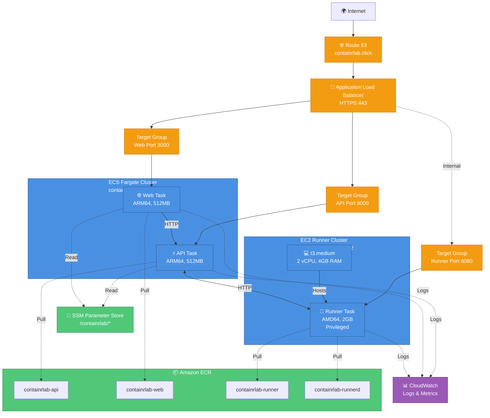

# ☁️ AWS Infrastructure

Complete AWS resource inventory, cost breakdown, and infrastructure details.

---

## Overview

ContainrLab runs on AWS using a hybrid ECS architecture:
- **ECS Fargate** for API and Web (serverless containers)
- **ECS on EC2** for Runner (Docker-in-Docker requires privileged mode)
- **Application Load Balancer** for HTTPS traffic
- **Amazon ECR** for Docker image storage
- **SSM Parameter Store** for secrets

**Region:** us-east-1  
**Monthly Cost:** ~$93 (optimized for 1-2 concurrent users)

---

## Infrastructure Diagram



**[→ View detailed infrastructure diagram](diagrams/aws-infrastructure.md)**

---

## Resource Inventory

### Compute Resources

#### ECS Fargate Cluster

**Cluster:** `containrlab-cluster`

| Resource | Details |
|----------|---------|
| **Platform** | AWS Fargate (serverless) |
| **Architecture** | ARM64 (Graviton2) |
| **Service** | containrlab-service |
| **Tasks** | 2 (API + Web) |
| **Task Definition** | containrlab-task:26 |

**API Task:**
- Image: `containrlab-api:latest` (ECR)
- CPU: 0.25 vCPU
- Memory: 512MB
- Port: 8000
- Environment: SSM parameters

**Web Task:**
- Image: `containrlab-web:latest` (ECR)
- CPU: 0.25 vCPU
- Memory: 512MB
- Port: 3000
- Environment: SSM parameters

---

#### ECS EC2 Cluster

**Cluster:** `containrlab-runner-ec2`

| Resource | Details |
|----------|---------|
| **Platform** | ECS on EC2 |
| **Instance Type** | t3.medium |
| **Architecture** | AMD64 (x86_64) |
| **vCPU** | 2 |
| **Memory** | 4GB RAM |
| **Service** | containrlab-runner-service |
| **Task Definition** | containrlab-runner:9 |

**Runner Task:**
- Image: `containrlab-runnerd:latest` (ECR)
- CPU: 1 vCPU
- Memory: 2GB
- Port: 8080
- Mode: **Privileged** (required for Docker-in-Docker)
- Socket: `/var/run/docker.sock` mounted

**EC2 Configuration:**
- AMI: ECS-optimized Amazon Linux 2
- IAM Role: ecsInstanceRole (with ECR permissions)
- User Data: Installs `amazon-ecr-credential-helper`
- Auto-scaling: Disabled (fixed 1 instance)

---

### Networking

#### VPC & Subnets

| Resource | ID/Details |
|----------|------------|
| **VPC** | Custom VPC with CIDR block |
| **Public Subnets** | 2 AZs (us-east-1a, us-east-1b) |
| **Private Subnets** | 2 AZs (us-east-1a, us-east-1b) |
| **Internet Gateway** | Attached to VPC |
| **NAT Gateway** | 1 (cost-optimized) |

**Network Flow:**
- Internet → ALB → ECS tasks (Fargate)
- Internet → ALB → EC2 instance (Runner)
- ECS tasks → NAT Gateway → Internet (for external APIs)

---

#### Application Load Balancer

**Main ALB:** `containrlab-alb`

| Property | Value |
|----------|-------|
| **Scheme** | Internet-facing |
| **Listeners** | HTTP:80 (redirect to HTTPS), HTTPS:443 |
| **SSL Certificate** | AWS Certificate Manager |
| **Target Groups** | 3 (API, Web, Runner) |

**Target Groups:**

| Name | Port | Health Check | Routing |
|------|------|--------------|---------|
| `containrlab-api-tg` | 8000 | `/healthz` | `api.containrlab.click` |
| `containrlab-web-tg` | 3000 | `/` | `app.containrlab.click` |
| `containrlab-runner-tg` | 8080 | `/health` | Internal only |

---

#### Route 53

**Hosted Zone:** `containrlab.click`

| Record | Type | Target |
|--------|------|--------|
| `api.containrlab.click` | ALIAS | ALB DNS name |
| `app.containrlab.click` | ALIAS | ALB DNS name |

---

### Container Registry

#### Amazon ECR Repositories

| Repository | Architecture | Purpose | Image Size |
|------------|--------------|---------|------------|
| `containrlab-api` | ARM64 | FastAPI backend | ~200MB |
| `containrlab-web` | ARM64 | Next.js frontend | ~180MB |
| `containrlab-runner` | AMD64 | Session containers | ~150MB |
| `containrlab-runnerd` | AMD64 | Runner supervisor | ~100MB |

**Configuration:**
- Lifecycle policy: Keep last 10 images
- Scan on push: Enabled
- Image tag immutability: Disabled

**[→ View task definitions](../infra/task-definitions/)**

---

### Secrets Management

#### SSM Parameter Store

**Namespace:** `/containrlab/*`

| Parameter | Type | Purpose |
|-----------|------|---------|
| `/containrlab/GITHUB_CLIENT_ID` | SecureString | GitHub OAuth app ID |
| `/containrlab/GITHUB_CLIENT_SECRET` | SecureString | GitHub OAuth secret |
| `/containrlab/NEXTAUTH_SECRET` | SecureString | NextAuth.js encryption key |
| `/containrlab/GEMINI_API_KEY` | SecureString | Google Gemini AI key |
| `/containrlab/SESSION_TTL_SECONDS` | String | Session timeout (1800s) |

**Encryption:** AWS KMS default key  
**Access:** IAM role-based (ecsTaskExecutionRole)

**[→ Complete secrets guide](SECRETS_MANAGEMENT.md)**

---

### Monitoring & Logging

#### CloudWatch Log Groups

| Log Group | Retention | Source |
|-----------|-----------|--------|
| `/ecs/containrlab-api` | 7 days | API container |
| `/ecs/containrlab-web` | 7 days | Web container |
| `/ecs/containrlab-runner` | 7 days | Runner container |
| `/aws/elasticloadbalancing/app/containrlab-alb` | 7 days | ALB access logs |

**Log Access:**
```bash
# Tail API logs
aws logs tail /ecs/containrlab-api --follow

# View last hour
aws logs tail /ecs/containrlab-api --since 1h
```

---

#### CloudWatch Metrics

**Available Metrics:**
- ECS Service: CPU, Memory, Running tasks
- ALB: Request count, Response time, HTTP errors
- EC2: CPU, Memory, Network, Disk

**CloudWatch Dashboard:** [View in Console](https://console.aws.amazon.com/cloudwatch/)

---

## Cost Breakdown

### Monthly Costs

**Total: ~$93/month** (optimized for 1-2 concurrent users)

| Service | Resource | Monthly Cost | Details |
|---------|----------|--------------|---------|
| **EC2** | t3.medium (24/7) | ~$30 | Runner instance |
| **ECS Fargate** | API + Web (ARM64) | ~$15 | 2 tasks × 0.5 vCPU × 1GB |
| **ALB** | Application Load Balancer | ~$20 | Base + LCU charges |
| **ECR** | 4 repositories (~10GB) | ~$1 | Storage only |
| **Data Transfer** | Outbound | ~$1 | Minimal usage |
| **Route 53** | Hosted zone | ~$1 | 2 records |
| **CloudWatch** | Logs & metrics | ~$5 | 7-day retention |
| **NAT Gateway** | 1 gateway | ~$10 | Data processing |
| **Other** | Misc services | ~$10 | Backups, misc |

---

### Cost Optimization Applied

**Changes Made (October 2025):**

| Optimization | Before | After | Savings |
|--------------|--------|-------|---------|
| **EC2 Instance** | m7i.large | t3.medium | $32/month |
| **Session Memory** | 2GB | 1.5GB | Better density |
| **Session TTL** | 45 min | 30 min | Resource efficiency |
| **Total Saved** | - | - | **26% reduction** |

**Original Cost:** ~$125/month  
**Optimized Cost:** ~$93/month  
**Annual Savings:** $384

---

### Cost by Category

```
💻 Compute (EC2 + Fargate): $45/month (48%)
🌐 Networking (ALB + NAT): $30/month (32%)
📦 Storage (ECR + Logs): $6/month (7%)
☁️ Other Services: $12/month (13%)
```

---

### Why t3.medium?

**Decision Rationale:**
- ✅ **Burstable CPU Credits** - Perfect for sporadic interactive workloads
- ✅ **4GB RAM** - Fits 2 concurrent sessions (1.5GB each) + OS overhead
- ✅ **Cost-effective** - 50% cheaper than m7i.large
- ✅ **Sufficient Performance** - Docker builds complete in reasonable time

**Capacity:**
- Max concurrent sessions: **2**
- Session resources: 1.5GB RAM, 1 vCPU each
- Typical usage: 1 user 90% of the time

---

## Scaling Options

### Horizontal Scaling (10-50 users)

**To scale for more users:**

1. **Add More EC2 Instances**
   - Auto Scaling Group for runner cluster
   - Scale based on CPU/Memory metrics
   - Cost: +$30/month per instance

2. **Replace SQLite with RDS**
   - PostgreSQL for persistence
   - Multi-AZ for high availability
   - Cost: +$15-30/month

3. **Add Redis for Caching**
   - Session state caching
   - Faster runner lookups
   - Cost: +$10-15/month (ElastiCache)

4. **Auto-scale Fargate Tasks**
   - Scale API/Web based on requests
   - Target tracking scaling
   - Cost: Variable based on load

**Estimated Cost:** ~$200-300/month for 10-50 users

---

### Vertical Scaling (2-5 users)

**To increase capacity slightly:**

1. **Upgrade EC2 to m5.large**
   - 2 vCPU, 8GB RAM
   - Support 4-5 concurrent sessions
   - Cost: +$40/month

2. **Increase Fargate Task Size**
   - 0.5 vCPU, 1GB per task
   - Handle more API load
   - Cost: +$10-15/month

**Estimated Cost:** ~$130-140/month for 2-5 users

---

## Disaster Recovery

### Backup Strategy

**What's backed up:**
- ✅ Infrastructure as Code (task definitions, configs in Git)
- ✅ ECR images (lifecycle policy keeps last 10)
- ✅ SSM parameters (encrypted, replicated)

**What's NOT backed up:**
- ❌ SQLite database (ephemeral by design)
- ❌ User session data (lost on deployment)
- ❌ CloudWatch logs (7-day retention)

---

### Recovery Procedures

**Complete Infrastructure Loss:**
1. Re-run deployment guide (2-3 hours)
2. All infrastructure recreated from scratch
3. User data lost (acceptable for learning platform)

**Single Service Failure:**
1. ECS automatically restarts failed tasks
2. ALB routes traffic to healthy targets
3. No manual intervention needed

**EC2 Instance Failure:**
1. Manually launch new EC2 instance
2. Use same launch template
3. ECS agent auto-registers
4. ~10 minutes to recover

---

## Security

### Network Security

**Security Groups:**

| Name | Type | Inbound | Outbound |
|------|------|---------|----------|
| `alb-sg` | ALB | 80, 443 (0.0.0.0/0) | All to ECS |
| `ecs-tasks-sg` | ECS | 8000, 3000 (from ALB) | All |
| `runner-sg` | EC2 | 8080 (from ECS), 22 (optional) | All |

**Best Practices:**
- ✅ ALB terminates SSL
- ✅ Private subnets for ECS tasks
- ✅ Security groups restrict access
- ✅ No public SSH access by default

---

### IAM Roles

**Key Roles:**

| Role | Purpose | Attached Policies |
|------|---------|-------------------|
| `ecsTaskExecutionRole` | ECS task startup | ECR pull, SSM read, CloudWatch logs |
| `ecsTaskRole` | Runtime permissions | None (tasks are restricted) |
| `ecsInstanceRole` | EC2 instance | ECS agent, ECR pull, CloudWatch |
| `github-actions-deploy` | CI/CD user | ECR push, ECS update |

**Principle of Least Privilege:**
- Tasks can only read SSM parameters in `/containrlab/*` namespace
- GitHub Actions can only push to ECR and update ECS
- No unnecessary permissions granted

---

## Monitoring

### Key Metrics to Watch

**ECS Services:**
- CPU utilization (target: <70%)
- Memory utilization (target: <80%)
- Running tasks count
- Task failures

**EC2 Instance:**
- CPU utilization (watch burst credits on t3)
- Memory utilization (target: <80%)
- Disk space
- Network bandwidth

**Application Load Balancer:**
- Request count
- Target response time (target: <500ms)
- HTTP 5xx errors
- Healthy target count

---

### Alarms

**Recommended CloudWatch Alarms:**

```bash
# High CPU on runner instance
aws cloudwatch put-metric-alarm \
  --alarm-name runner-high-cpu \
  --metric-name CPUUtilization \
  --namespace AWS/EC2 \
  --statistic Average \
  --period 300 \
  --threshold 80 \
  --comparison-operator GreaterThanThreshold

# ECS task failures
aws cloudwatch put-metric-alarm \
  --alarm-name ecs-task-failures \
  --metric-name TaskCount \
  --namespace AWS/ECS \
  --statistic Sum \
  --period 60 \
  --threshold 0 \
  --comparison-operator LessThanThreshold
```

---

## Resource Naming Conventions

**Pattern:** `containrlab-{resource-type}-{optional-detail}`

| Resource Type | Example |
|---------------|---------|
| **Clusters** | `containrlab-cluster`, `containrlab-runner-ec2` |
| **Services** | `containrlab-service`, `containrlab-runner-service` |
| **Task Defs** | `containrlab-task`, `containrlab-runner` |
| **Target Groups** | `containrlab-api-tg`, `containrlab-web-tg` |
| **ECR Repos** | `containrlab-api`, `containrlab-web` |
| **SSM Params** | `/containrlab/GITHUB_CLIENT_ID` |

**Benefits:**
- Easy to identify resources
- Searchable in AWS Console
- Clear ownership

---

## Maintenance Tasks

### Weekly

- [ ] Check CloudWatch logs for errors
- [ ] Verify all health checks passing
- [ ] Monitor EC2 burst credits (t3 instances)

### Monthly

- [ ] Review CloudWatch costs
- [ ] Clean up old ECR images (automated by lifecycle policy)
- [ ] Check for AWS service updates

### Quarterly

- [ ] Review IAM policies for least privilege
- [ ] Update ECS task definitions if needed
- [ ] Evaluate scaling needs

---

## Troubleshooting

### High Costs

**Check:**
1. NAT Gateway data processing charges
2. CloudWatch log ingestion
3. Data transfer costs
4. Idle resources

**Solutions:**
- Review log retention (reduce from 7 to 3 days)
- Check for unexpected data transfers
- Verify no unused ALBs or instances

---

### Performance Issues

**Runner Slow:**
- Check EC2 CPU burst credits (`aws cloudwatch get-metric-statistics`)
- Verify memory usage (< 80%)
- Consider upgrading to m5.large

**API/Web Slow:**
- Check Fargate task CPU/Memory
- Review ALB target response time
- Check runner health (may be bottleneck)

---

### Service Won't Start

**Check:**
1. ECS task logs in CloudWatch
2. Task definition has correct image URIs
3. SSM parameters exist and are accessible
4. Security groups allow required traffic

**Common Issues:**
- Missing SSM parameters
- Wrong ECR image architecture
- Security group blocks traffic

---

## Related Documentation

- **[Architecture](ARCHITECTURE.md)** - System design and components
- **[Deployment Guide](DEPLOYMENTS.md)** - How to deploy
- **[CI/CD Setup](CI_CD_SETUP.md)** - Automated deployment
- **[Secrets Management](SECRETS_MANAGEMENT.md)** - Managing credentials
- **[Infrastructure Diagram](diagrams/aws-infrastructure.md)** - Visual overview

---

<div align="center">

**[← Back to Documentation](README.md)** | **[Deploy Now →](DEPLOYMENTS.md)**

</div>
