# 🔄 CI/CD Setup Guide

Automated testing and deployment with GitHub Actions.

---

## Overview

ContainrLab uses **GitHub Actions** for continuous integration and deployment. Every push to `main` triggers automated testing, building, and deployment to AWS production.

**What you get:**
- ✅ Automated testing on every PR
- ✅ Multi-architecture Docker builds (ARM64 + AMD64)
- ✅ Automatic deployment to ECS on merge
- ✅ Zero-downtime rolling updates
- ✅ Easy rollback via Git

**Time to setup:** ~15 minutes  
**Deployment time:** ~10-15 minutes per push

---

## CI/CD Pipeline

```mermaid
graph LR
    Dev[👨‍💻 Push Code] -->|Trigger| PR[📝 Pull Request]
    PR -->|Run| Test[🧪 Test Workflow]
    
    Test --> T1[Backend Tests]
    Test --> T2[Frontend Tests]
    Test --> T3[Code Quality]
    
    T1 --> Merge{✅ Tests Pass?}
    T2 --> Merge
    T3 --> Merge
    
    Merge -->|Yes| Main[Merge to main]
    Merge -->|No| Fix[❌ Fix Issues]
    Fix --> Dev
    
    Main -->|Trigger| Deploy[🚀 Deploy Workflow]
    
    Deploy --> D1[Build Images<br/>ARM64 + AMD64]
    D1 --> D2[Push to ECR]
    D2 --> D3[Update ECS]
    D3 --> D4[Health Check]
    D4 --> Prod[✅ Production]
    
    classDef dev fill:#3498db,color:#fff
    classDef test fill:#f39c12,color:#fff
    classDef deploy fill:#e74c3c,color:#fff
    classDef prod fill:#27ae60,color:#fff
    
    class Dev,PR,Main dev
    class Test,T1,T2,T3,Merge,Fix test
    class Deploy,D1,D2,D3,D4 deploy
    class Prod prod
```



**[→ View detailed deployment flow](diagrams/deployment-flow.md)**

---

## Prerequisites

Before setting up CI/CD, you need:

- [x] AWS infrastructure deployed → [Deployment Guide](DEPLOYMENTS.md)
- [x] GitHub repository (your fork or clone)
- [x] Admin access to the repository
- [x] AWS credentials for GitHub Actions

---

## Setup Steps

### Step 1: Create IAM User for GitHub Actions

GitHub Actions needs AWS credentials to push images and update ECS.

```bash
# Create dedicated IAM user
aws iam create-user --user-name github-actions-deploy

# Attach ECR permissions (push images)
aws iam attach-user-policy \
  --user-name github-actions-deploy \
  --policy-arn arn:aws:iam::aws:policy/AmazonEC2ContainerRegistryPowerUser

# Attach ECS permissions (update services)
aws iam attach-user-policy \
  --user-name github-actions-deploy \
  --policy-arn arn:aws:iam::aws:policy/AmazonECS_FullAccess

# Create access key
aws iam create-access-key --user-name github-actions-deploy
```

**Save the output!** You'll need:
- `AccessKeyId`
- `SecretAccessKey`

---

### Step 2: Add GitHub Secrets

1. Go to your repository on GitHub
2. Click `Settings` → `Secrets and variables` → `Actions`
3. Click `New repository secret`
4. Add these secrets:

| Secret Name | Value | Description |
|-------------|-------|-------------|
| `AWS_ACCESS_KEY_ID` | From Step 1 | AWS access key for GitHub Actions |
| `AWS_SECRET_ACCESS_KEY` | From Step 1 | AWS secret key for GitHub Actions |

**Screenshot path:**
```
Repository → Settings → Secrets and variables → Actions → New repository secret
```

---

### Step 3: Update Workflow Configuration

Edit `.github/workflows/deploy.yml` with your AWS details:

```yaml
env:
  AWS_REGION: us-east-1
  AWS_ACCOUNT_ID: YOUR-ACCOUNT-ID  # ← Update this!
  ECR_REGISTRY: YOUR-ACCOUNT-ID.dkr.ecr.us-east-1.amazonaws.com  # ← Update this!
```

**Find your AWS Account ID:**
```bash
aws sts get-caller-identity --query Account --output text
```

---

### Step 4: Test the Pipeline

```bash
# Make a small change
echo "# Testing CI/CD" >> README.md

# Commit and push
git add README.md
git commit -m "test: verify CI/CD pipeline"
git push origin main
```

**Monitor the workflow:**
1. Go to `Actions` tab in GitHub
2. Click on the running workflow
3. Watch each step execute

---

### Step 5: Verify Deployment

Once the workflow completes:

```bash
# Check API health
curl https://api.your-domain.com/healthz

# Expected: {"status":"ok"}

# Visit web app
open https://app.your-domain.com
```

🎉 **Your CI/CD pipeline is live!**

---

## Workflows Explained

### Test Workflow (`.github/workflows/test.yml`)

**Trigger:** Every push to any branch, every PR

**What it does:**
1. **Backend Tests**
   - Checkout code
   - Set up Python 3.11
   - Install dependencies
   - Run pytest
   - Check code formatting with black

2. **Frontend Tests**
   - Checkout code
   - Set up Node.js 20
   - Install dependencies
   - Run npm test
   - Build production bundle (verify no errors)

**Configuration:**
```yaml
name: Test

on:
  push:
    branches: [ "**" ]  # All branches
  pull_request:
    branches: [ "main" ]

jobs:
  backend-tests:
    runs-on: ubuntu-latest
    # ... backend test steps

  frontend-tests:
    runs-on: ubuntu-latest
    # ... frontend test steps
```

---

### Deploy Workflow (`.github/workflows/deploy.yml`)

**Trigger:** Push to `main` branch only

**What it does:**

#### 1. Setup Phase
- Checkout code
- Configure AWS credentials (from GitHub Secrets)
- Login to Amazon ECR

#### 2. Build Phase
Multi-architecture Docker builds:

```yaml
# API & Web: ARM64 (for Fargate)
docker buildx build \
  --platform linux/arm64 \
  --push \
  -t $ECR_REGISTRY/containrlab-api:latest \
  backend/

# Runner & RunnerD: AMD64 (for EC2)
docker buildx build \
  --platform linux/amd64 \
  --push \
  -t $ECR_REGISTRY/containrlab-runner:latest \
  runner/
```

**Why different architectures:**
- Fargate supports ARM64 (cheaper, efficient)
- EC2 instance is AMD64 (x86_64)

#### 3. Deploy Phase
- Force new deployment on ECS services
- Wait for services to reach stable state
- Verify health checks pass

**ECS Rolling Update:**
1. Start new tasks with new images
2. Wait for health checks to pass
3. Stop old tasks
4. **Zero downtime!**

---

### Deploy Workflow Configuration

**Full workflow file:**

```yaml
name: Deploy to AWS

on:
  push:
    branches: [ "main" ]

env:
  AWS_REGION: us-east-1
  AWS_ACCOUNT_ID: ${{ secrets.AWS_ACCOUNT_ID }}
  ECR_REGISTRY: ${{ secrets.AWS_ACCOUNT_ID }}.dkr.ecr.us-east-1.amazonaws.com

jobs:
  deploy:
    runs-on: ubuntu-latest

    steps:
      - name: Checkout code
        uses: actions/checkout@v4

      - name: Configure AWS credentials
        uses: aws-actions/configure-aws-credentials@v4
        with:
          aws-access-key-id: ${{ secrets.AWS_ACCESS_KEY_ID }}
          aws-secret-access-key: ${{ secrets.AWS_SECRET_ACCESS_KEY }}
          aws-region: ${{ env.AWS_REGION }}

      - name: Login to Amazon ECR
        run: |
          aws ecr get-login-password --region $AWS_REGION | \
            docker login --username AWS --password-stdin $ECR_REGISTRY

      - name: Set up Docker Buildx
        uses: docker/setup-buildx-action@v3

      - name: Build and push API (ARM64)
        run: |
          docker buildx build \
            --platform linux/arm64 \
            --push \
            -t $ECR_REGISTRY/containrlab-api:latest \
            backend/

      - name: Build and push Web (ARM64)
        run: |
          docker buildx build \
            --platform linux/arm64 \
            --push \
            -t $ECR_REGISTRY/containrlab-web:latest \
            frontend/

      - name: Build and push Runner (AMD64)
        run: |
          docker buildx build \
            --platform linux/amd64 \
            --push \
            -t $ECR_REGISTRY/containrlab-runner:latest \
            runner/

      - name: Build and push RunnerD (AMD64)
        run: |
          docker buildx build \
            --platform linux/amd64 \
            --push \
            -t $ECR_REGISTRY/containrlab-runnerd:latest \
            runnerd/

      - name: Deploy to ECS
        run: |
          # Update API service
          aws ecs update-service \
            --cluster containrlab-cluster \
            --service containrlab-service \
            --force-new-deployment

          # Update Runner service
          aws ecs update-service \
            --cluster containrlab-runner-ec2 \
            --service containrlab-runner-service \
            --force-new-deployment

      - name: Wait for deployment
        run: |
          aws ecs wait services-stable \
            --cluster containrlab-cluster \
            --services containrlab-service

      - name: Verify health
        run: |
          curl -f https://api.your-domain.com/healthz || exit 1
```

---

## Deployment Time

**Typical deployment timeline:**

| Stage | Duration | Description |
|-------|----------|-------------|
| **Checkout & Setup** | ~30 seconds | Clone repo, configure AWS |
| **Build API** | ~2-3 min | Build ARM64 image |
| **Build Web** | ~2-3 min | Build ARM64 image |
| **Build Runner** | ~1-2 min | Build AMD64 image |
| **Build RunnerD** | ~1-2 min | Build AMD64 image |
| **Push to ECR** | ~1-2 min | Upload all images |
| **ECS Update** | ~3-5 min | Rolling update, health checks |
| **Total** | **10-15 min** | From push to production |

---

## Rollback Strategy

### Via Git Revert

**Fastest method** - Revert the problematic commit:

```bash
# Revert the last commit
git revert HEAD

# Push to trigger re-deployment
git push origin main
```

This creates a new commit that undoes the changes, triggering automatic re-deployment.

---

### Via ECS Task Definition

**Manual method** - Rollback to previous task definition:

```bash
# List recent task definitions
aws ecs list-task-definitions \
  --family-prefix containrlab-task \
  --sort DESC \
  --max-items 5

# Update service to previous version
aws ecs update-service \
  --cluster containrlab-cluster \
  --service containrlab-service \
  --task-definition containrlab-task:25  # Previous version
```

---

## Troubleshooting

### Workflow Fails: "AWS credentials not found"

**Problem:** GitHub Secrets not configured or invalid

**Solution:**
```bash
# Verify secrets exist
# Go to: Repository → Settings → Secrets → Actions
# Ensure AWS_ACCESS_KEY_ID and AWS_SECRET_ACCESS_KEY are present

# Test credentials locally
export AWS_ACCESS_KEY_ID=xxx
export AWS_SECRET_ACCESS_KEY=xxx
aws sts get-caller-identity
```

---

### Workflow Fails: "ECR push denied"

**Problem:** IAM user lacks ECR permissions

**Solution:**
```bash
# Attach ECR policy to IAM user
aws iam attach-user-policy \
  --user-name github-actions-deploy \
  --policy-arn arn:aws:iam::aws:policy/AmazonEC2ContainerRegistryPowerUser

# Verify permissions
aws iam list-attached-user-policies --user-name github-actions-deploy
```

---

### Workflow Fails: "ECS update failed"

**Problem:** IAM user lacks ECS permissions or service doesn't exist

**Solution:**
```bash
# Attach ECS policy
aws iam attach-user-policy \
  --user-name github-actions-deploy \
  --policy-arn arn:aws:iam::aws:policy/AmazonECS_FullAccess

# Verify service exists
aws ecs describe-services \
  --cluster containrlab-cluster \
  --services containrlab-service
```

---

### Build Fails: "Platform mismatch"

**Problem:** Wrong architecture specified for build

**Solution:**
- API & Web must be `linux/arm64` (Fargate)
- Runner & RunnerD must be `linux/amd64` (EC2)

Check `.github/workflows/deploy.yml`:
```yaml
# Correct platforms
--platform linux/arm64  # For API & Web
--platform linux/amd64  # For Runner & RunnerD
```

---

### Deployment Succeeds But Site Down

**Problem:** ECS tasks failing health checks

**Solution:**
```bash
# Check task status
aws ecs describe-services \
  --cluster containrlab-cluster \
  --services containrlab-service

# View task logs
aws logs tail /ecs/containrlab-api --follow

# Common issues:
# - Missing SSM parameters
# - Wrong environment variables
# - Container port mismatch
# - Security group rules
```

---

### Tests Fail on CI But Pass Locally

**Problem:** Environment differences

**Common causes:**
- Missing environment variables in CI
- Different Python/Node versions
- Timezone differences
- File path issues

**Solution:**
```yaml
# Add env vars to test workflow
env:
  TESTING: true
  TZ: UTC

# Match Python/Node versions
- uses: actions/setup-python@v5
  with:
    python-version: '3.11'  # Match local version
```

---

## Best Practices

### 1. Test Before Merging

Always create a PR and wait for tests to pass:

```bash
# Create feature branch
git checkout -b feature/my-feature

# Make changes
git add .
git commit -m "feat: add new feature"

# Push and create PR
git push origin feature/my-feature
```

Wait for tests to pass, then merge to `main`.

---

### 2. Small, Frequent Deployments

Deploy often with small changes:

✅ **Good:**
- One feature per PR
- Deploy 3-5 times per day
- Easy to debug issues
- Quick rollback if needed

❌ **Bad:**
- Accumulate many changes
- Deploy once per week
- Hard to find what broke
- Risky rollbacks

---

### 3. Monitor Deployments

Watch the GitHub Actions output:

```
Actions → Click running workflow → Expand steps
```

Look for:
- ✅ All builds succeed
- ✅ Images pushed to ECR
- ✅ ECS services update
- ✅ Health checks pass

---

### 4. Use Meaningful Commit Messages

GitHub Actions shows commit messages in workflow:

✅ **Good:**
```bash
git commit -m "fix: correct session timeout calculation"
git commit -m "feat: add lab 4 for docker compose"
```

❌ **Bad:**
```bash
git commit -m "update"
git commit -m "fixes"
```

---

## Skipping CI/CD

Sometimes you want to skip deployment:

### Skip via Commit Message

```bash
git commit -m "docs: update README [skip ci]"
git push origin main
```

Supported keywords:
- `[skip ci]`
- `[ci skip]`
- `[no ci]`
- `[skip actions]`

### Skip via Workflow Paths

Edit `.github/workflows/deploy.yml`:

```yaml
on:
  push:
    branches: [ "main" ]
    paths-ignore:
      - 'docs/**'
      - '**.md'
      - 'LICENSE'
```

Now changes to docs won't trigger deployment.

---

## Advanced Configuration

### Deploy to Staging Environment

Create a staging branch and workflow:

**`.github/workflows/deploy-staging.yml`:**
```yaml
on:
  push:
    branches: [ "staging" ]

env:
  ECS_CLUSTER: containrlab-staging
  # ... staging environment variables
```

### Matrix Builds

Build multiple versions in parallel:

```yaml
strategy:
  matrix:
    python-version: [3.10, 3.11, 3.12]

steps:
  - uses: actions/setup-python@v5
    with:
      python-version: ${{ matrix.python-version }}
```

### Caching Dependencies

Speed up builds with caching:

```yaml
- name: Cache pip dependencies
  uses: actions/cache@v4
  with:
    path: ~/.cache/pip
    key: ${{ runner.os }}-pip-${{ hashFiles('**/requirements.txt') }}
```

---

## Monitoring & Notifications

### Slack Notifications

Get notified on deployment success/failure:

```yaml
- name: Notify Slack
  if: always()
  uses: 8398a7/action-slack@v3
  with:
    status: ${{ job.status }}
    webhook_url: ${{ secrets.SLACK_WEBHOOK }}
```

### Email Notifications

GitHub sends emails on workflow failures by default.

**Configure:** Settings → Notifications → Actions

---

## Cost Considerations

**GitHub Actions pricing:**
- **Free tier:** 2,000 minutes/month (public repos)
- **Private repos:** 2,000 minutes/month (included)

**Current usage:**
- ~15 min per deployment
- ~5 min per test run
- **~20 min per PR** (test + deploy)

**Cost:** Free for most use cases!

---

## Related Documentation

- **[Deployment Guide](DEPLOYMENTS.md)** - Manual deployment steps
- **[Architecture](ARCHITECTURE.md)** - System design
- **[AWS Infrastructure](AWS_INFRASTRUCTURE.md)** - Resource details
- **[Secrets Management](SECRETS_MANAGEMENT.md)** - Managing credentials
- **[Deployment Flow Diagram](diagrams/deployment-flow.md)** - Visual pipeline

---

<div align="center">

**[← Back to Documentation](README.md)** | **[Manual Deployment →](DEPLOYMENTS.md)**

</div>
