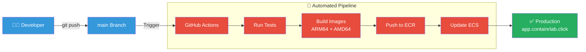

# 🚀 AWS Deployment Guide

Complete guide for deploying ContainrLab to AWS production environment.

---

## Overview

Deploy ContainrLab to AWS using ECS (Fargate + EC2) with automated CI/CD or manual deployment.

**What you'll deploy:**
- Frontend & Backend on ECS Fargate (ARM64)
- Runner on EC2 with ECS (AMD64, Docker-in-Docker)
- Application Load Balancer with HTTPS
- Secrets in SSM Parameter Store
- Docker images in Amazon ECR

**Time:** 2-3 hours (first-time setup) | 15 minutes (CI/CD deployments)  
**Cost:** ~$93/month → [See cost breakdown](AWS_INFRASTRUCTURE.md)

---

## Deployment Flow



**[→ View detailed deployment flow](diagrams/deployment-flow.md)**

---

## Deployment Options

### Option 1: Automated CI/CD ⭐ Recommended

**Best for:** Continuous deployment, team collaboration, production use

**What you get:**
- ✅ Automatic deployment on push to `main`
- ✅ Automated testing before deployment
- ✅ Rolling updates with zero downtime
- ✅ Easy rollback to previous versions

**[→ Jump to CI/CD Setup](#option-1-automated-cicd-deployment)**

---

### Option 2: Manual Deployment

**Best for:** Initial setup, learning, custom configurations

**What you get:**
- ✅ Full control over every step
- ✅ Understanding of AWS infrastructure
- ✅ Useful for debugging and customization

**[→ Jump to Manual Setup](#option-2-manual-deployment)**

---

## Prerequisites

### AWS Account

- [x] AWS Account with billing enabled
- [x] IAM user with administrator access
- [x] AWS CLI installed and configured
- [x] Domain name (or use subdomain of existing)
- [x] SSL certificate in AWS Certificate Manager

### Local Tools

- [x] Docker Desktop with buildx support
- [x] Git
- [x] Node.js 20+ (for testing)
- [x] Python 3.11+ (for testing)

### External Services

- [x] **GitHub OAuth App** - [Create here](https://github.com/settings/developers)
- [x] **Google Gemini API Key** (optional) - [Get here](https://makersuite.google.com/app/apikey)

---

## Option 1: Automated CI/CD Deployment

### Step 1: Fork Repository

```bash
# Fork on GitHub, then clone your fork
git clone https://github.com/YOUR-USERNAME/ContainrLab.git
cd ContainrLab
```

---

### Step 2: Initial AWS Setup

You only need to do this once.

#### 2.1 Create ECR Repositories

```bash
# Set your AWS region and account ID
export AWS_REGION=us-east-1
export AWS_ACCOUNT_ID=$(aws sts get-caller-identity --query Account --output text)

# Create ECR repositories
aws ecr create-repository --repository-name containrlab-api --region $AWS_REGION
aws ecr create-repository --repository-name containrlab-web --region $AWS_REGION
aws ecr create-repository --repository-name containrlab-runner --region $AWS_REGION
aws ecr create-repository --repository-name containrlab-runnerd --region $AWS_REGION
```

#### 2.2 Create ECS Clusters

```bash
# Create Fargate cluster for API/Web
aws ecs create-cluster --cluster-name containrlab-cluster --region $AWS_REGION

# Create EC2 cluster for Runner
aws ecs create-cluster --cluster-name containrlab-runner-ec2 --region $AWS_REGION
```

#### 2.3 Launch EC2 Instance for Runner

```bash
# Use ECS-optimized Amazon Linux 2
# Instance type: t3.medium
# IAM role: ecsInstanceRole (with ECR pull permissions)
# User data script should install amazon-ecr-credential-helper

# See full launch configuration in infra/service-configs/
```

**[→ Detailed infrastructure setup](AWS_INFRASTRUCTURE.md)**

#### 2.4 Create Load Balancer & Target Groups

```bash
# Create Application Load Balancer
# Create target groups for API, Web, Runner
# Configure HTTPS listener with SSL certificate
# Set up host-based routing (api.domain.com, app.domain.com)

# See detailed steps in AWS_INFRASTRUCTURE.md
```

---

### Step 3: Configure Secrets

Store all secrets in AWS SSM Parameter Store:

```bash
# GitHub OAuth credentials
aws ssm put-parameter \
  --name /containrlab/GITHUB_CLIENT_ID \
  --value "your-github-client-id" \
  --type SecureString

aws ssm put-parameter \
  --name /containrlab/GITHUB_CLIENT_SECRET \
  --value "your-github-client-secret" \
  --type SecureString

# NextAuth secret (generate random)
aws ssm put-parameter \
  --name /containrlab/NEXTAUTH_SECRET \
  --value "$(openssl rand -hex 32)" \
  --type SecureString

# Gemini API key (optional)
aws ssm put-parameter \
  --name /containrlab/GEMINI_API_KEY \
  --value "your-gemini-api-key" \
  --type SecureString

# Session TTL (30 minutes = 1800 seconds)
aws ssm put-parameter \
  --name /containrlab/SESSION_TTL_SECONDS \
  --value "1800" \
  --type String
```

**[→ Complete secrets guide](SECRETS_MANAGEMENT.md)**

---

### Step 4: Set Up GitHub Actions

#### 4.1 Create IAM User for GitHub Actions

```bash
# Create IAM user
aws iam create-user --user-name github-actions-deploy

# Attach required policies
aws iam attach-user-policy \
  --user-name github-actions-deploy \
  --policy-arn arn:aws:iam::aws:policy/AmazonEC2ContainerRegistryPowerUser

aws iam attach-user-policy \
  --user-name github-actions-deploy \
  --policy-arn arn:aws:iam::aws:policy/AmazonECS_FullAccess

# Create access key
aws iam create-access-key --user-name github-actions-deploy
```

**Save the Access Key ID and Secret Access Key!**

#### 4.2 Add GitHub Secrets

Go to your fork: `Settings` → `Secrets and variables` → `Actions`

Add these secrets:
- `AWS_ACCESS_KEY_ID` - From step 4.1
- `AWS_SECRET_ACCESS_KEY` - From step 4.1

#### 4.3 Update Workflow Files

Edit `.github/workflows/deploy.yml`:

```yaml
env:
  AWS_REGION: us-east-1
  AWS_ACCOUNT_ID: YOUR-ACCOUNT-ID  # Update this
```

**[→ Complete CI/CD setup guide](CI_CD_SETUP.md)**

---

### Step 5: Deploy

```bash
# Push to main branch
git add .
git commit -m "Initial deployment"
git push origin main
```

**GitHub Actions will automatically:**
1. Run tests
2. Build Docker images (ARM64 + AMD64)
3. Push images to ECR
4. Update ECS services
5. Verify health checks

**Monitor progress:** `https://github.com/YOUR-USERNAME/ContainrLab/actions`

---

### Step 6: Verify Deployment

```bash
# Check API health
curl https://api.YOUR-DOMAIN.com/healthz

# Expected: {"status":"ok"}

# Visit web app
open https://app.YOUR-DOMAIN.com
```

**🎉 Your ContainrLab instance is live!**

---

## Option 2: Manual Deployment

For complete control or initial setup.

### Phase 1: AWS Infrastructure Setup

#### 1.1 Clone Repository

```bash
git clone https://github.com/sanjayb-28/ContainrLab.git
cd ContainrLab
```

#### 1.2 Configure Environment

```bash
export AWS_REGION=us-east-1
export AWS_ACCOUNT_ID=$(aws sts get-caller-identity --query Account --output text)
export DOMAIN=your-domain.com
```

#### 1.3 Create ECR Repositories

```bash
# API image (ARM64 for Fargate)
aws ecr create-repository \
  --repository-name containrlab-api \
  --region $AWS_REGION

# Web image (ARM64 for Fargate)
aws ecr create-repository \
  --repository-name containrlab-web \
  --region $AWS_REGION

# Runner image (AMD64 for EC2)
aws ecr create-repository \
  --repository-name containrlab-runner \
  --region $AWS_REGION

# RunnerD image (AMD64 for EC2)
aws ecr create-repository \
  --repository-name containrlab-runnerd \
  --region $AWS_REGION
```

#### 1.4 Create ECS Clusters

```bash
# Fargate cluster for API and Web
aws ecs create-cluster \
  --cluster-name containrlab-cluster \
  --region $AWS_REGION

# EC2 cluster for Runner
aws ecs create-cluster \
  --cluster-name containrlab-runner-ec2 \
  --region $AWS_REGION
```

---

### Phase 2: Secrets Management

Create all parameters in SSM Parameter Store:

```bash
# GitHub OAuth
aws ssm put-parameter --name /containrlab/GITHUB_CLIENT_ID --value "xxx" --type SecureString
aws ssm put-parameter --name /containrlab/GITHUB_CLIENT_SECRET --value "xxx" --type SecureString

# NextAuth
aws ssm put-parameter --name /containrlab/NEXTAUTH_SECRET --value "$(openssl rand -hex 32)" --type SecureString

# Gemini AI (optional)
aws ssm put-parameter --name /containrlab/GEMINI_API_KEY --value "xxx" --type SecureString

# Session configuration
aws ssm put-parameter --name /containrlab/SESSION_TTL_SECONDS --value "1800" --type String
```

**[→ All SSM parameters](../infra/ssm-parameters/parameters.md)**

---

### Phase 3: Build and Push Images

#### 3.1 Login to ECR

```bash
aws ecr get-login-password --region $AWS_REGION | \
  docker login --username AWS --password-stdin \
  $AWS_ACCOUNT_ID.dkr.ecr.$AWS_REGION.amazonaws.com
```

#### 3.2 Build Multi-Architecture Images

**Important:** API/Web use ARM64 (Fargate), Runner uses AMD64 (EC2)

```bash
# Create buildx builder
docker buildx create --name multiarch --use

# Build API (ARM64)
docker buildx build \
  --platform linux/arm64 \
  --push \
  -t $AWS_ACCOUNT_ID.dkr.ecr.$AWS_REGION.amazonaws.com/containrlab-api:latest \
  -f backend/Dockerfile .

# Build Web (ARM64)
docker buildx build \
  --platform linux/arm64 \
  --push \
  -t $AWS_ACCOUNT_ID.dkr.ecr.$AWS_REGION.amazonaws.com/containrlab-web:latest \
  -f frontend/Dockerfile .

# Build Runner (AMD64)
docker buildx build \
  --platform linux/amd64 \
  --push \
  -t $AWS_ACCOUNT_ID.dkr.ecr.$AWS_REGION.amazonaws.com/containrlab-runner:latest \
  runner/

# Build RunnerD (AMD64)
docker buildx build \
  --platform linux/amd64 \
  --push \
  -t $AWS_ACCOUNT_ID.dkr.ecr.$AWS_REGION.amazonaws.com/containrlab-runnerd:latest \
  runnerd/
```

---

### Phase 4: Launch EC2 Instance

```bash
# Use ECS-optimized Amazon Linux 2 AMI
# Instance type: t3.medium (2 vCPU, 4GB RAM)
# IAM role: ecsInstanceRole

# User data script for ECR authentication:
```

```bash
#!/bin/bash
yum install -y amazon-ecr-credential-helper
mkdir -p /root/.docker
echo '{"credsStore": "ecr-login"}' > /root/.docker/config.json
systemctl restart docker
```

**[→ Complete EC2 setup](AWS_INFRASTRUCTURE.md#ec2-runner-instance)**

---

### Phase 5: Create ECS Task Definitions

Use the JSON files in `infra/task-definitions/`:

```bash
# Register API/Web task definition
aws ecs register-task-definition \
  --cli-input-json file://infra/task-definitions/api-web-task.json

# Register Runner task definition
aws ecs register-task-definition \
  --cli-input-json file://infra/task-definitions/runner-task.json
```

Update the JSON files with your:
- AWS Account ID
- ECR image URIs
- SSM parameter ARNs

---

### Phase 6: Create ECS Services

```bash
# Create API service (Fargate)
aws ecs create-service \
  --cluster containrlab-cluster \
  --service-name containrlab-api-service \
  --task-definition containrlab-task \
  --desired-count 1 \
  --launch-type FARGATE \
  --network-configuration "..." \
  --load-balancers "..."

# Create Web service (Fargate)
aws ecs create-service \
  --cluster containrlab-cluster \
  --service-name containrlab-web-service \
  --task-definition containrlab-task \
  --desired-count 1 \
  --launch-type FARGATE \
  --network-configuration "..." \
  --load-balancers "..."

# Create Runner service (EC2)
aws ecs create-service \
  --cluster containrlab-runner-ec2 \
  --service-name containrlab-runner-service \
  --task-definition containrlab-runner \
  --desired-count 1 \
  --launch-type EC2 \
  --load-balancers "..."
```

**[→ Complete service configurations](../infra/service-configs/)**

---

### Phase 7: Configure Load Balancer

1. Create Application Load Balancer
2. Create target groups:
   - `containrlab-api-tg` (port 8000)
   - `containrlab-web-tg` (port 3000)
   - `containrlab-runner-tg` (port 8080)
3. Configure HTTPS listener (port 443)
4. Add rules for host-based routing:
   - `api.your-domain.com` → API target group
   - `app.your-domain.com` → Web target group

**[→ Load balancer setup](AWS_INFRASTRUCTURE.md#load-balancer)**

---

### Phase 8: Configure DNS

Add DNS records in Route 53 (or your DNS provider):

```
api.your-domain.com  →  ALIAS to ALB
app.your-domain.com  →  ALIAS to ALB
```

---

### Phase 9: Verify Deployment

```bash
# Test API
curl https://api.your-domain.com/healthz

# Test Web
curl https://app.your-domain.com

# Create test session
# (requires authentication)
```

---

## Post-Deployment

### Monitoring

**CloudWatch Logs:**
- `/ecs/containrlab-api` - API logs
- `/ecs/containrlab-web` - Web logs
- `/ecs/containrlab-runner` - Runner logs

**CloudWatch Metrics:**
- ECS service CPU/Memory usage
- ALB request count and latency
- EC2 instance metrics

**[→ Monitoring guide](AWS_INFRASTRUCTURE.md#monitoring)**

---

### Updates & Maintenance

**Via CI/CD:**
```bash
# Just push to main
git push origin main
```

**Manual:**
```bash
# Rebuild and push images
# Then force new deployment
aws ecs update-service \
  --cluster containrlab-cluster \
  --service containrlab-api-service \
  --force-new-deployment
```

---

### Rollback

**Via CI/CD:**
```bash
# Revert the commit
git revert HEAD
git push origin main
```

**Manual:**
```bash
# Update to previous task definition
aws ecs update-service \
  --cluster containrlab-cluster \
  --service containrlab-api-service \
  --task-definition containrlab-task:25  # Previous version
```

---

## Troubleshooting

### Deployment Fails

**Check GitHub Actions logs:**
1. Go to Actions tab in GitHub
2. Click the failed workflow
3. Review build/deploy step logs

**Common issues:**
- Wrong AWS credentials → Check GitHub Secrets
- ECR push fails → Verify IAM permissions
- ECS update fails → Check task definition

---

### Services Won't Start

**Check ECS task logs:**
```bash
aws ecs describe-tasks \
  --cluster containrlab-cluster \
  --tasks $(aws ecs list-tasks --cluster containrlab-cluster --query 'taskArns[0]' --output text)
```

**Common issues:**
- Missing SSM parameters → Verify all parameters exist
- Image pull errors → Check ECR repository permissions
- Port conflicts → Verify target group health checks

---

### Health Checks Fail

**Check ALB target health:**
```bash
aws elbv2 describe-target-health \
  --target-group-arn arn:aws:elasticloadbalancing:...
```

**Common issues:**
- Wrong health check path → Should be `/healthz` for API
- Security group rules → Allow ALB to reach ECS tasks
- Service not listening → Check container logs

---

### EC2 Runner Issues

**SSH into EC2 instance:**
```bash
# Check Docker is running
sudo systemctl status docker

# Check ECS agent
sudo systemctl status ecs

# Check ECR authentication
docker pull $AWS_ACCOUNT_ID.dkr.ecr.$AWS_REGION.amazonaws.com/containrlab-runner:latest
```

**Common issues:**
- ECR authentication fails → Install `amazon-ecr-credential-helper`
- Out of memory → Upgrade to larger instance type
- Container won't start → Check privileged mode is enabled

---

## Cost Management

**Current setup:** ~$93/month

**Cost breakdown:**
- EC2 t3.medium: ~$30/month
- ECS Fargate: ~$15/month
- ALB: ~$20/month
- Other services: ~$28/month

**[→ Detailed cost analysis](AWS_INFRASTRUCTURE.md#cost-breakdown)**

**Optimization tips:**
- Stop EC2 instance when not in use (development)
- Use Fargate Spot for non-production
- Clean up old Docker images in ECR
- Monitor CloudWatch usage

---

## Next Steps

- **[Set up CI/CD](CI_CD_SETUP.md)** - Automate future deployments
- **[Configure secrets](SECRETS_MANAGEMENT.md)** - Rotate credentials
- **[Monitor costs](AWS_INFRASTRUCTURE.md)** - Track spending
- **[Scale up](AWS_INFRASTRUCTURE.md#scaling)** - Add more capacity

---

## Related Documentation

- **[Architecture](ARCHITECTURE.md)** - How the system works
- **[AWS Infrastructure](AWS_INFRASTRUCTURE.md)** - Resource details and costs
- **[CI/CD Setup](CI_CD_SETUP.md)** - Automated deployment
- **[Secrets Management](SECRETS_MANAGEMENT.md)** - Managing credentials
- **[Deployment Flow Diagram](diagrams/deployment-flow.md)** - Visual pipeline

---

<div align="center">

**[← Back to Documentation](README.md)** | **[Set Up CI/CD →](CI_CD_SETUP.md)**

</div>
