# AWS Infrastructure Diagram

```mermaid
graph TB
    %% Internet
    Internet[🌍 Internet<br/>Users]
    
    %% Route 53
    Route53[🌐 Route 53<br/>containrlab.click<br/>- app.containrlab.click<br/>- api.containrlab.click]
    
    %% Load Balancer
    ALB[🔀 Application Load Balancer<br/>- HTTPS:443<br/>- SSL Certificate]
    
    %% Target Groups
    TG_API[Target Group<br/>containrlab-api-tg<br/>Port 8000]
    TG_WEB[Target Group<br/>containrlab-web-tg<br/>Port 3000]
    TG_RUNNER[Target Group<br/>containrlab-runner-tg<br/>Port 8080]
    
    %% ECS Fargate Cluster
    subgraph Fargate["ECS Fargate Cluster<br/>containrlab-cluster"]
        API_Task[⚡ API Task<br/>containrlab-task:26<br/>ARM64, 512MB<br/>0.25 vCPU]
        WEB_Task[🌐 Web Task<br/>containrlab-task:26<br/>ARM64, 512MB<br/>0.25 vCPU]
    end
    
    %% EC2 Runner Cluster
    subgraph EC2_Cluster["EC2 Runner Cluster<br/>containrlab-runner-ec2"]
        EC2[💻 t3.medium Instance<br/>2 vCPU, 4GB RAM<br/>Amazon Linux 2]
        Runner_Task[🔧 Runner Task<br/>containrlab-runner:9<br/>AMD64, 2GB<br/>1 vCPU<br/>Privileged Mode]
    end
    
    %% ECR
    subgraph ECR["📦 Amazon ECR"]
        ECR_API[containrlab-api]
        ECR_WEB[containrlab-web]
        ECR_RUNNER[containrlab-runner]
        ECR_RUNNERD[containrlab-runnerd]
    end
    
    %% SSM Parameter Store
    subgraph SSM["🔑 SSM Parameter Store"]
        SSM_Params["/containrlab/*<br/>- GITHUB_CLIENT_ID<br/>- GITHUB_CLIENT_SECRET<br/>- NEXTAUTH_SECRET<br/>- GEMINI_API_KEY<br/>- SESSION_TTL_SECONDS"]
    end
    
    %% CloudWatch
    CW[📊 CloudWatch<br/>- Logs<br/>- Metrics<br/>- Alarms]
    
    %% Flow: Internet to Services
    Internet --> Route53
    Route53 --> ALB
    
    %% ALB to Target Groups
    ALB -->|api.containrlab.click| TG_API
    ALB -->|app.containrlab.click| TG_WEB
    ALB -.->|Internal| TG_RUNNER
    
    %% Target Groups to Tasks
    TG_API --> API_Task
    TG_WEB --> WEB_Task
    TG_RUNNER --> Runner_Task
    
    %% EC2 runs Runner Task
    EC2 -->|Hosts| Runner_Task
    
    %% Tasks communicate
    API_Task <-->|HTTP| Runner_Task
    WEB_Task -->|HTTP| API_Task
    
    %% Tasks pull from ECR
    API_Task -.->|Pull Image| ECR_API
    WEB_Task -.->|Pull Image| ECR_WEB
    Runner_Task -.->|Pull Image| ECR_RUNNER
    Runner_Task -.->|Pull Session Images| ECR_RUNNERD
    
    %% Tasks read from SSM
    API_Task -.->|Read Secrets| SSM_Params
    WEB_Task -.->|Read Secrets| SSM_Params
    
    %% CloudWatch Logs
    API_Task -.->|Logs| CW
    WEB_Task -.->|Logs| CW
    Runner_Task -.->|Logs| CW
    ALB -.->|Access Logs| CW
    EC2 -.->|Metrics| CW
    
    %% Styling
    classDef aws fill:#FF9900,stroke:#CC7A00,color:#000
    classDef compute fill:#4a90e2,stroke:#2d5a8c,color:#fff
    classDef storage fill:#50c878,stroke:#2d7a4a,color:#fff
    classDef network fill:#f39c12,stroke:#c87f0a,color:#fff
    classDef monitoring fill:#9b59b6,stroke:#6c3483,color:#fff
    
    class Route53,ALB network
    class TG_API,TG_WEB,TG_RUNNER network
    class Fargate,EC2_Cluster,API_Task,WEB_Task,EC2,Runner_Task compute
    class ECR,SSM storage
    class CW monitoring
```

## AWS Resources

### Compute
- **ECS Fargate Cluster**: `containrlab-cluster`
  - API Task (ARM64, 512MB)
  - Web Task (ARM64, 512MB)
- **EC2 Runner Cluster**: `containrlab-runner-ec2`
  - t3.medium instance (2 vCPU, 4GB RAM)
  - Runner Task (AMD64, 2GB, privileged)

### Networking
- **Route 53**: `containrlab.click` domain
- **Application Load Balancer**: HTTPS termination
- **Target Groups**: API, Web, Runner

### Storage & Secrets
- **Amazon ECR**: 4 Docker image repositories
- **SSM Parameter Store**: Encrypted secrets

### Monitoring
- **CloudWatch**: Logs, metrics, alarms

### Region
- **us-east-1** (all resources)

### Cost
- **~$93/month** (optimized for 1-2 concurrent users)
