# Deployment Flow Diagram

```mermaid
graph LR
    %% Source
    Dev[👨‍💻 Developer<br/>Local Machine]
    
    %% Git
    PR[📝 Pull Request]
    Main[🌳 main Branch]
    
    %% GitHub Actions - Test Workflow
    subgraph Test["🧪 Test Workflow (test.yml)"]
        T1[Checkout Code]
        T2[Setup Python/Node]
        T3[Install Dependencies]
        T4[Run Backend Tests<br/>pytest]
        T5[Run Frontend Tests<br/>npm test]
        T6[Code Formatting<br/>black --check]
    end
    
    %% GitHub Actions - Deploy Workflow
    subgraph Deploy["🚀 Deploy Workflow (deploy.yml)"]
        D1[Checkout Code]
        D2[Configure AWS]
        D3[Login to ECR]
        
        subgraph Build["🔨 Build Images"]
            B1[Build API<br/>ARM64]
            B2[Build Web<br/>ARM64]
            B3[Build Runner<br/>AMD64]
            B4[Build RunnerD<br/>AMD64]
        end
        
        subgraph Push["📦 Push to ECR"]
            P1[Push API Image]
            P2[Push Web Image]
            P3[Push Runner Image]
            P4[Push RunnerD Image]
        end
        
        D4[Update ECS Services]
        D5[Wait for Stable]
        D6[Health Check]
    end
    
    %% AWS
    ECR[📦 Amazon ECR<br/>Image Registry]
    ECS_Fargate[⚡ ECS Fargate<br/>API + Web]
    ECS_EC2[🔧 ECS EC2<br/>Runner]
    
    %% Production
    Prod[✅ Production<br/>app.containrlab.click]
    
    %% Flow: Development
    Dev -->|git push| PR
    PR -->|Trigger| Test
    
    %% Test Workflow
    T1 --> T2 --> T3 --> T4
    T3 --> T5
    T4 --> T6
    
    %% Merge to Main
    PR -->|Merge<br/>After Tests Pass| Main
    Main -->|Trigger| Deploy
    
    %% Deploy Workflow
    D1 --> D2 --> D3
    D3 --> Build
    
    %% Build Phase
    B1 --> P1
    B2 --> P2
    B3 --> P3
    B4 --> P4
    
    %% Push Phase
    P1 --> ECR
    P2 --> ECR
    P3 --> ECR
    P4 --> ECR
    
    %% Update ECS
    ECR -->|Pull New Images| D4
    D4 --> D5 --> D6
    
    %% Deploy to Production
    D6 -->|Rolling Update| ECS_Fargate
    D6 -->|Rolling Update| ECS_EC2
    
    ECS_Fargate --> Prod
    ECS_EC2 --> Prod
    
    %% Styling
    classDef dev fill:#3498db,stroke:#2874a6,color:#fff
    classDef test fill:#f39c12,stroke:#c87f0a,color:#fff
    classDef build fill:#9b59b6,stroke:#6c3483,color:#fff
    classDef deploy fill:#e74c3c,stroke:#c0392b,color:#fff
    classDef aws fill:#FF9900,stroke:#CC7A00,color:#000
    classDef prod fill:#27ae60,stroke:#1e8449,color:#fff
    
    class Dev,PR,Main dev
    class Test,T1,T2,T3,T4,T5,T6 test
    class Build,B1,B2,B3,B4 build
    class Deploy,D1,D2,D3,D4,D5,D6,Push,P1,P2,P3,P4 deploy
    class ECR,ECS_Fargate,ECS_EC2 aws
    class Prod prod
```

## Deployment Stages

### 1. Development
- Developer pushes code to feature branch
- Creates pull request to `main`

### 2. Testing (Automatic on PR)
- **Backend Tests**: pytest runs all unit tests
- **Frontend Tests**: npm test runs React tests
- **Code Quality**: black checks Python formatting

### 3. Merge to Main
- Tests must pass before merge
- Merge triggers deployment workflow

### 4. Build Images
- **Multi-architecture builds**:
  - API & Web: ARM64 (Fargate)
  - Runner & RunnerD: AMD64 (EC2)
- Uses Docker buildx for cross-compilation

### 5. Push to ECR
- All 4 images pushed to Amazon ECR
- Tagged with commit SHA and `latest`

### 6. Deploy to ECS
- **Rolling update strategy**:
  - Start new tasks with new image
  - Wait for health checks
  - Stop old tasks
  - Zero downtime deployment

### 7. Verification
- Health checks confirm deployment
- CloudWatch logs monitored
- Production accessible at app.containrlab.click

## Rollback Strategy

If deployment fails:
1. GitHub Actions workflow fails
2. ECS keeps running old tasks
3. Manual rollback: Update ECS to previous task definition
4. Or: Revert Git commit and redeploy

## Deployment Time

- **Build**: ~5-7 minutes
- **Push**: ~2-3 minutes
- **Deploy**: ~3-5 minutes
- **Total**: ~10-15 minutes from push to production
