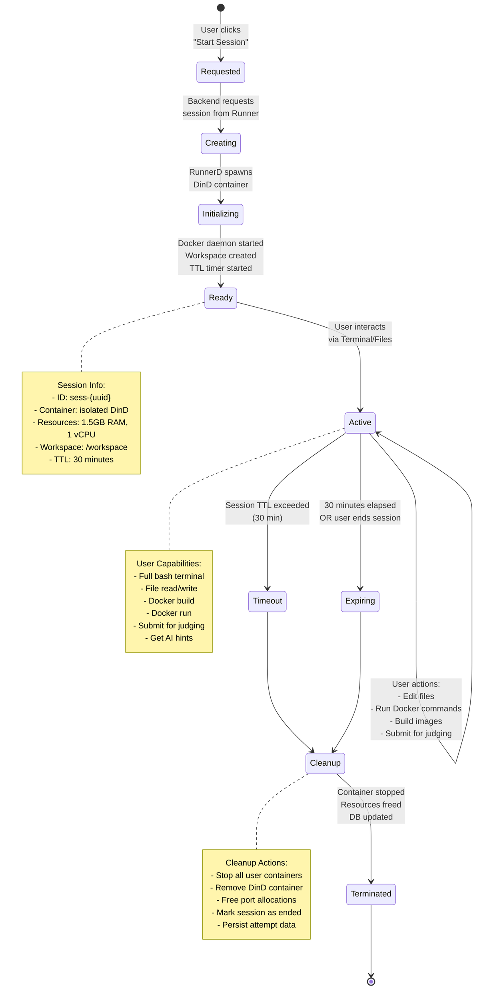
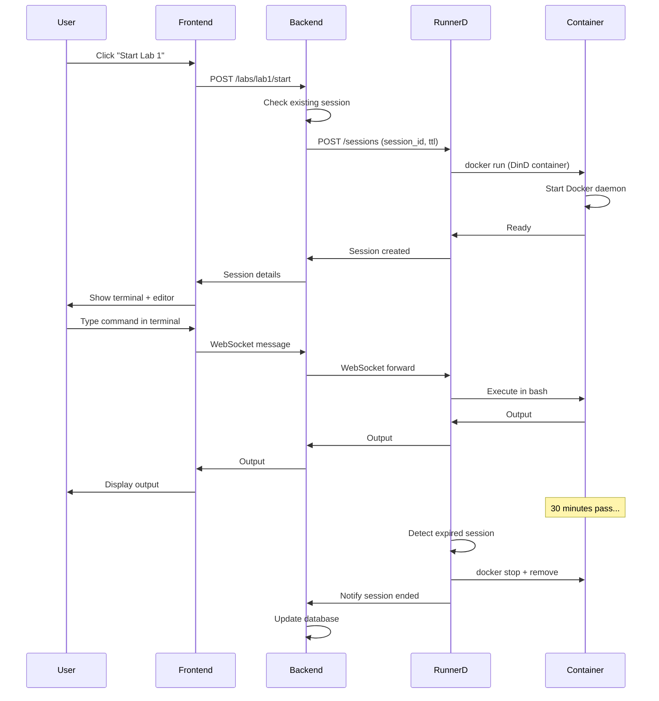

# Session Lifecycle Diagram

## Session States

### 1. Requested
- **Trigger**: User clicks "Start Session" on a lab
- **Action**: Frontend sends POST request to backend
- **Data**: User ID, Lab slug

### 2. Creating
- **Action**: Backend calls RunnerD API to create session
- **Validation**: Check if user has active session for this lab
- **Generation**: Create unique session ID (`sess-{uuid}`)

### 3. Initializing
- **Action**: RunnerD spawns Docker-in-Docker container
- **Container Setup**:
  - Name: `sess-{session_id}`
  - Image: `containrlab-runner:latest`
  - Resources: 1.5GB RAM, 1 vCPU
  - Mode: Privileged (for Docker-in-Docker)
- **Workspace**: Creates `/workspace` directory
- **TTL**: Starts 30-minute countdown

### 4. Ready
- **Verification**: Docker daemon is running
- **Response**: Backend returns session details to frontend
- **Display**: Frontend shows terminal and file editor
- **State Storage**: Session saved to SQLite database

### 5. Active
**User can perform:**
- **Terminal**: Execute bash commands via WebSocket
- **Files**: Create, edit, delete files in `/workspace`
- **Docker**: Build images, run containers
- **Judge**: Submit lab for automated validation
- **AI**: Request hints and explanations

**Backend tracks:**
- Last activity timestamp
- Judge attempt count
- Files created

### 6. Expiring (Normal End)
**Triggers:**
- User clicks "End Session"
- User navigates away
- User explicitly ends

**Action:**
- Backend calls RunnerD to stop session
- Graceful shutdown initiated

### 7. Timeout (Auto Expiry)
**Trigger:**
- 30 minutes elapsed since creation
- No user activity

**Action:**
- RunnerD automatic cleanup job detects expired session
- Forces cleanup process

### 8. Cleanup
**RunnerD executes:**
1. Stop all containers user created
2. Remove session DinD container
3. Free allocated ports
4. Remove temporary files

**Backend executes:**
1. Mark session as ended in database
2. Record end timestamp
3. Persist any judge attempts
4. Free session slot for user

### 9. Terminated
- **State**: Session fully cleaned up
- **Data**: Historical data persisted
- **Resources**: All freed
- **User**: Can start new session

## Session Data Flow

## Resource Management

### Per Session
- **Memory**: 1.5GB limit
- **CPU**: 1 vCPU limit
- **Disk**: Ephemeral (lost on cleanup)
- **Network**: Isolated (no inter-session communication)

### System Limits
- **Concurrent Sessions**: 2 (on t3.medium EC2)
- **Total Memory**: 4GB (EC2 instance)
- **User Limit**: 1 active session per lab per user

### Cleanup Triggers
1. **User action**: Manual end session
2. **TTL expiry**: 30 minutes since creation
3. **System**: RunnerD cleanup job (every 5 minutes)
4. **Error**: Container crashes or becomes unresponsive

## Session Security

- **Isolation**: Each session in separate container
- **Resource Limits**: Prevents resource exhaustion
- **Network**: No access to other sessions
- **Time Limit**: Automatic cleanup prevents abuse
- **Validation**: Backend validates all session requests
