# System Architecture Diagram

```mermaid
graph TB
    %% User Layer
    User[👤 User Browser]
    
    %% Frontend Layer
    Web[🌐 Next.js Frontend<br/>Port 3000<br/>- React UI<br/>- Auth<br/>- Terminal<br/>- File Editor]
    
    %% Backend Layer
    API[⚡ FastAPI Backend<br/>Port 8000<br/>- REST API<br/>- WebSocket Proxy<br/>- Session Management<br/>- Judge Orchestration]
    
    %% Runner Layer
    RunnerD[🔧 RunnerD Service<br/>Port 8080<br/>- Session Containers<br/>- Docker-in-Docker<br/>- File Operations]
    
    %% Session Containers
    Session1[🐋 Session Container<br/>sess-abc123<br/>- Docker Daemon<br/>- Workspace<br/>- Bash Terminal]
    Session2[🐋 Session Container<br/>sess-xyz789<br/>- Docker Daemon<br/>- Workspace<br/>- Bash Terminal]
    
    %% External Services
    GitHub[🔐 GitHub OAuth]
    Gemini[🤖 Google Gemini AI]
    
    %% Data Storage
    DB[(💾 SQLite Database<br/>- Users<br/>- Sessions<br/>- Attempts)]
    
    %% User Interactions
    User -->|HTTPS| Web
    User -.->|OAuth Login| GitHub
    GitHub -.->|User Profile| User
    
    %% Frontend to Backend
    Web -->|API Requests| API
    Web <-->|WebSocket<br/>Terminal| API
    
    %% Backend to External Services
    API -->|Authenticate| GitHub
    API -->|AI Hints| Gemini
    API -->|Read/Write| DB
    
    %% Backend to Runner
    API -->|Create Session| RunnerD
    API -->|Execute Commands| RunnerD
    API -->|Build Docker| RunnerD
    API -->|File Operations| RunnerD
    API <-->|Terminal WebSocket| RunnerD
    
    %% Runner to Sessions
    RunnerD -->|Spawn Container| Session1
    RunnerD -->|Spawn Container| Session2
    RunnerD -->|Manage Lifecycle| Session1
    RunnerD -->|Manage Lifecycle| Session2
    
    %% Styling
    classDef frontend fill:#4a90e2,stroke:#2d5a8c,color:#fff
    classDef backend fill:#50c878,stroke:#2d7a4a,color:#fff
    classDef runner fill:#f39c12,stroke:#c87f0a,color:#fff
    classDef session fill:#e74c3c,stroke:#c0392b,color:#fff
    classDef external fill:#9b59b6,stroke:#6c3483,color:#fff
    classDef storage fill:#34495e,stroke:#2c3e50,color:#fff
    
    class Web frontend
    class API backend
    class RunnerD runner
    class Session1,Session2 session
    class GitHub,Gemini external
    class DB storage
```

## Key Components

**Frontend (Next.js)**
- User interface with terminal and file editor
- GitHub OAuth authentication
- WebSocket for real-time terminal

**Backend (FastAPI)**
- REST API for all operations
- WebSocket proxy to runner
- Session and user management
- Judge orchestration for lab validation

**Runner (RunnerD)**
- Spawns Docker-in-Docker session containers
- Manages session lifecycle (30min TTL)
- Executes Docker commands in isolation
- Provides terminal access via WebSocket

**External Services**
- GitHub OAuth for authentication
- Google Gemini AI for hints and explanations

**Data Storage**
- SQLite for users, sessions, and lab attempts
- Ephemeral (resets on deployment)
